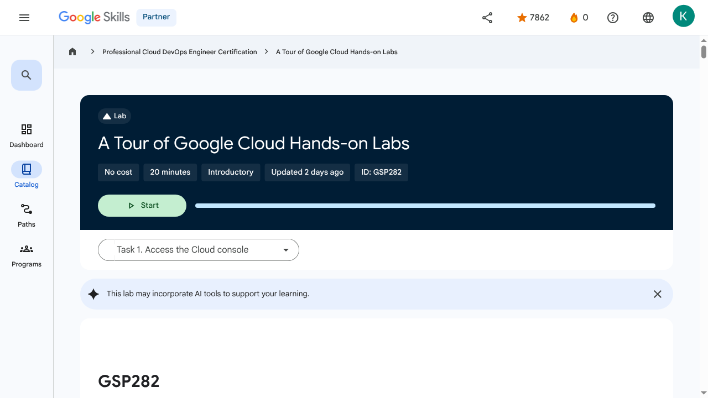
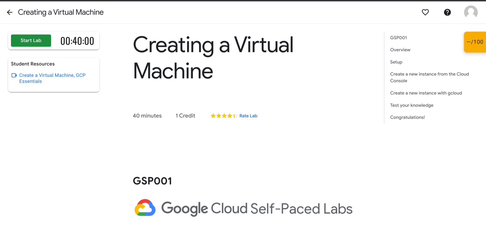
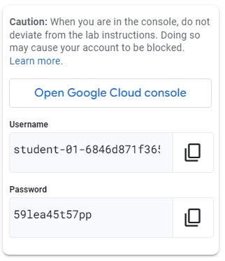
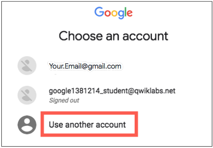
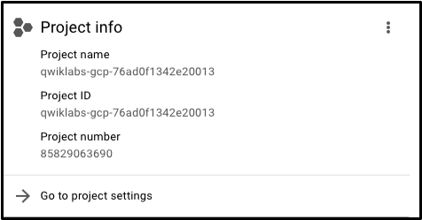
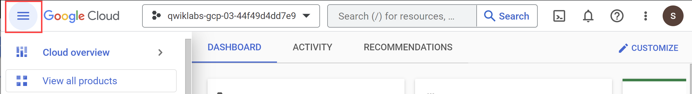
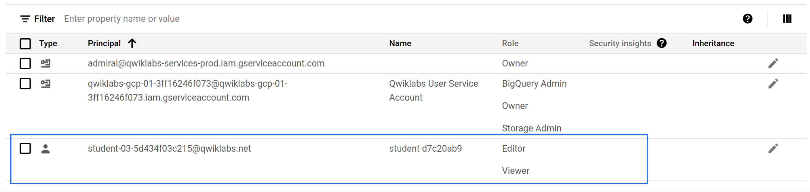
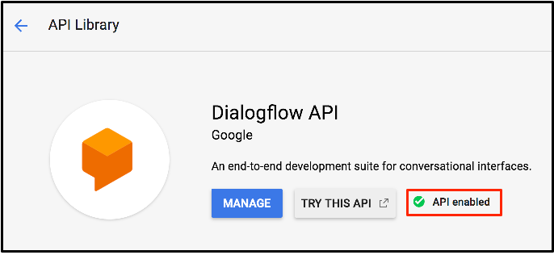
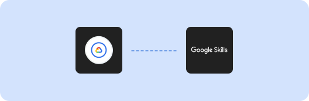

# A Tour of Google Cloud Hands-on Labs | Google Skills for Partners

## Metadata

- **Requested URL:** https://partner.skills.google/focuses/11600?parent=catalog&path=20
- **Actual URL:** https://partner.skills.google/focuses/11600?parent=catalog&path=20
- **Plugin:** `google_skills`
- **Generated:** 2026-07-13T09:07:29+00:00

## Outputs

- [Readable HTML](readable_page.html)
- [Offline HTML](offline_page.html)
- [Raw HTML](page.html)
- [Plain text](page_text.txt)
- [Screenshot](screenshot.png)

## Screenshot

## Transcript

_No transcript extracted._

## Page Text

Partner
0
navigate_next
Professional Cloud DevOps Engineer Certification
navigate_next
A Tour of Google Cloud Hands-on Labs
This lab may incorporate AI tools to support your learning.
GSP282
Overview

Google Cloud is a suite of cloud services hosted on Google's infrastructure. From computing and storage to data analytics, machine learning, and networking, Google Cloud offers a wide variety of services and APIs that can be integrated with any cloud-computing application or project, from personal to enterprise-grade.

Google Skills is where you can access Google Cloud’s entire catalog of labs and courses. You can discover learning paths, build in-demand cloud skills, track your activity progress, and validate your knowledge with badges. Qwiklabs is the technology platform the labs and courses sit on. You may see the Qwiklabs name in your Google Cloud learning adventure.

In this introductory-level lab, you take your first steps with Google Cloud by getting hands-on practice with the Cloud console—an in-browser UI that lets you access and manage Google Cloud services. You will identify key features of Google Cloud and also learn about the details of the lab environment.

If you are new to cloud computing or looking for an overview of Google Cloud and the Qwiklabs platform, you are in the right place. Read on to learn about the specifics of this lab and areas that you will get hands-on practice with.

Objectives

In this lab, you learn how to perform the following tasks:

Access the Cloud console with specific credentials to explore the lab platform and identify key features of a lab environment.
View various Google Cloud projects and identify common misconceptions about them.
Use the Google Cloud console navigation menu to identify types of Google Cloud services.
Manage basic roles and use the Cloud IAM service to inspect actions available to specific users.
Explore the API library and examine its chief features.
Prerequisites

This is an introductory-level lab and the first lab you should take if you're unfamiliar with Google Cloud. If you are already experienced with Cloud console, consider taking one of the following labs:

Get Started with Cloud Shell and gcloud
Create a Virtual Machine

If you decide to take one of these labs, be sure to end this lab now.

If you have a personal or corporate Google Cloud account or project, sign out of that account. If you stay logged in to your personal/corporate account and run the lab in the same browser, your credentials could get confused, resulting in getting logged out of the lab accidentally.

If you are using a Pixelbook, run your lab in an Incognito window.

Lab fundamentals
Features and components

Regardless of topic or expertise level, all labs share a common interface. The lab that you're taking should look similar to this:

Note: You are not taking the "Creating a Virtual Machine" lab shown in the image; it is used as an example to highlight common features across labs.

Read the following lab component definitions, and then locate them in the interface.

Start Lab (button)

Clicking this button creates a temporary Google Cloud environment, with all the necessary services and credentials enabled, so you can get hands-on practice with the lab's material. This also starts a countdown timer.

Credit

The price of a lab. 1 Credit is usually equivalent to 1 US dollar (discounts are available when you purchase credits in bulk). Some introductory-level labs (like this one) are free. The more specialized labs cost more because they involve heavier computing tasks and demand more Google Cloud resources.

Time

Specifies the amount of time you have to complete a lab. When you click the Start Lab button, the timer counts down until it reaches 00:00:00. When it does, your temporary Google Cloud environment and resources are deleted. Ample time is given to complete a lab, but make sure you don't work on something else while a lab is running: you risk losing all of your hard work!

Score

Many labs include a score. This feature is called "activity tracking" and ensures that you complete specified steps in a lab. To pass a lab with activity tracking, you need to complete all the steps in order. Only then can you receive completion credit.

Paying for a lab

Some labs are free, but others require you to pay. For those, when you click the Start Lab button, a dialog gives you the choice to launch the lab with an access code or credits. If you don't have either, click Buy credits and follow the instructions.

Reading and following instructions

This browser tab contains the lab instructions. When you start a lab, the Google Cloud console user interface opens in a new browser tab. You may need to switch between the two browser tabs to read the instructions and then perform the tasks. Depending on your physical computer setup, you could also move the two tabs to separate monitors.

Test your understanding

Answer the following multiple-choice questions to reinforce your understanding of the concepts covered so far.

Task 1. Access the Cloud console
Start the lab
Now that you understand the key features and components of a lab, click Start Lab.

It may take a moment for the Google Cloud environment and credentials to spin up. When the timer starts counting down and the Start Lab button changes to a red End Lab button, everything is in place and you're ready to sign in to the Cloud console.

Note: Do not click the End Lab button until you have completed all the tasks in the lab. When you click the button, your temporary credentials are invalidated and you won't be able to access the work you've done throughout the lab.

You must click this button when you finish; if you do not, you won't be able to take another lab. (The Qwiklabs platform has protections in place to prevent concurrent enrollment.)
Lab details pane

Now that your lab instance is up and running, refer to the Lab details pane on the left. It contains an Open Google Cloud console button, credentials (username and password), and a Project ID field.

Note: Your credentials should resemble but won't match the image; every lab instance generates new temporary credentials.

Now examine each of these components.

Open Google Cloud console

This button opens the Cloud console: the web console and central development hub for Google Cloud. You do the majority of your work in Google Cloud from the interface that this button launches.

Username and Password

These credentials represent an identity in the Cloud Identity and Access Management (Cloud IAM) service. This identity has access permissions (a role or roles) that allow you to work with Google Cloud resources in the project you've been allocated. For the purposes of a lab, these credentials are temporary and only work for the duration of the lab. When the timer reaches 00:00:00, you no longer have access to your Google Cloud project with temporary, lab-assigned credentials.

Project ID

A Google Cloud project is an organizing entity for your Google Cloud resources. It often contains resources and services; for example, it may hold a pool of virtual machines, a set of databases, and a network that connects them together. Projects also contain settings and permissions, which specify security rules and who has access to what resources.

A Project ID is a unique identifier that is used to link Google Cloud resources and APIs to your specific project. Project IDs are unique across Google Cloud: there can be only one qwiklabs-gcp-xxx...., which makes it globally identifiable.

Sign in to Google Cloud

Now that you have a better understanding of the Lab details pane, use its contents to sign in to the Cloud console.

Click Open Google Cloud console.

This opens the Google Cloud sign-in page in a new browser tab.

If you've ever signed in to a Google application like Gmail, this page should look familiar.

Tip Open the tabs in separate windows, side-by-side.

Note: If the Choose an account page opens, click Use Another Account. 
The Username from the Lab Details pane automatically fills in. Click Next.

Wait! Make sure to use the student-xx-xxxxxx@qwiklabs.net email to sign in, NOT your personal or company email address!

Note: The username that resembles student-xx-xxxxxx@qwiklabs.net is a Google account that was created for your use as a student. It has a specific domain name, which is qwiklabs.net, and has been assigned IAM roles that allow you to access the Google Cloud project that you have been provisioned.

Copy the Password from the Lab details pane, paste it in the Password field, and click Next.

Click I understand to indicate your acknowledgement of Google's terms of service and privacy policy.

On the Welcome page, check Terms of Service to agree to Google Cloud's terms of service, and click Agree and continue.

You've successfully accessed the Cloud console with your student credentials!

Test your understanding

Answer the following multiple-choice questions to reinforce your understanding of the concepts covered so far.

Now that you have signed in to the Cloud console and understand the basics of your credentials, it's time to learn a little bit more about Google Cloud projects.

Task 2. View projects in the Cloud console

Google Cloud projects were explained in the section about the contents of the Lab details pane. Here's the definition once again:

A Google Cloud project is an organizing entity for your Google Cloud resources. It often contains resources and services; for example, it may hold a pool of virtual machines, a set of databases, and a network that connects them together. Projects also contain settings and permissions, which specify security rules and who has access to what resources.

The upper-left corner of the central pane contains a card labeled Project info.

Your project has a name, number, and ID. These identifiers are frequently used when interacting with Google Cloud services. You are working with one project to get experience with a specific service or feature of Google Cloud.

View all projects

In this lab, you actually have access to more than one Google Cloud project. In fact, in some labs you may be given more than one project in order to complete the assigned tasks.

In the Google Cloud console title bar, next to your project name, click the drop-down menu.
In the Select a project dialog, click All. The resulting list of projects includes a "Qwiklabs Resources" project.
Note: Do not switch over to the Qwiklabs Resources project at this point! However, you may need to use it in other labs.

It's not uncommon for large enterprises or experienced users of Google Cloud to have dozens to thousands of Google Cloud projects. Organizations use Google Cloud in different ways, so projects are a good method for organizing cloud computing services (by team or product, for example.)

The "Qwiklabs Resources" project contains files, datasets, and machine images for certain labs and can be accessed from every Google Cloud lab environment. It's important to note that "Qwiklabs Resources" is shared (read-only) with all student users, which means that you cannot delete or modify it.

The Google Cloud project that you are working with is temporary, which means that the project and everything it contains gets deleted when the lab ends. Whenever you start a new lab, you are given access to one or more new Google Cloud projects, and that (not "Qwiklabs Resources") is where you run all of the lab steps.

Click Cancel to return to the Cloud overview page.
Test your understanding

Answer the following multiple-choice questions to reinforce your understanding of the concepts covered so far.

Navigation menu and services

The Google Cloud console title bar also contains the Navigation menu.

Clicking this icon opens (or hides) the Navigation menu that provides quick access to Google Cloud's core services.

If the menu isn't open, click the Navigation menu.
Click View all Products, then scroll through the categories of tools and services.

You can refer to the Google Cloud products overview page for documentation that covers each of these categories in more detail.

Task 3. Review and modify roles and permissions

In addition to cloud computing services, Google Cloud also contains a collection of permissions and roles that define who has access to what resources. You can use the Cloud Identity and Access Management (Cloud IAM) service to inspect and modify roles and permissions.

View your roles and permissions

On the Navigation menu (), click IAM & Admin > IAM. This opens a page that contains a list of users, permissions, and roles granted to specific accounts.

Find the student "@qwiklabs" username you signed in to the lab with.

The Principal column displays student-xx-xxxxxx@qwiklabs.net (In this lab, the principal email address matches the username you signed in with: .) The Name column displays student XXXXXXXX, and the Role column displays Editor, which is one of three basic roles offered by Google Cloud.

Basic roles set project-level permissions and, unless otherwise specified, control access and management to all Google Cloud services. The following table pulls definitions from the roles documentation, which gives a brief overview of viewer, editor, and owner role permissions.

Role Name	Permissions
roles/viewer	Permissions for read-only actions that do not affect state, such as viewing (but not modifying) existing resources or data.
roles/editor	All viewer permissions, plus permissions for actions that modify state, such as changing existing resources.
roles/owner	All editor permissions and permissions for the following actions: manage roles and permissions for a project and all resources within the project; set up billing for a project.

As an editor, you can create, modify, and delete Google Cloud resources. However, you can't add or delete members from Google Cloud projects.

Grant an IAM role

In this section, you make a simple IAM update to grant a principal the viewer role on the project.

On the Navigation menu (), click IAM & Admin > IAM.

Click Grant access.

In the Add principals section, enter an identifier  for the principal.

From the Select a role drop-down menu in the Assign roles section, search for Viewer, then click Viewer.

Click Save.

Verify that the principal and the corresponding role are listed on the IAM page.

You have successfully granted an IAM role to a second student account.

Note: You now encounter a unique feature called Activity Tracking that assesses completion of a task. As you complete tasks and verify these with 'Check my progress' tests, notice that your score increases in the box in the upper right corner. This scoring determines lab completion towards the accomplishment of badges and credentials. Scoring also contributes to leaderboard position in lab games.

In this case, Activity Tracking is provided to verify whether you have granted the IAM role.

Click Check my progress to verify the objective.Grant an IAM role

Test your understanding

Answer the following multiple-choice questions to reinforce your understanding of the concepts covered so far.

Task 4. Enable APIs and services

Google Cloud APIs are a key part of Google Cloud. Like services, the 200+ APIs range in areas from business administration to machine learning and all easily integrate with Google Cloud projects and applications.

APIs are application programming interfaces that you can call directly or via the client libraries. Cloud APIs use resource-oriented design principles as described in the API Design Guide.

When a lab provides a new Google Cloud project for a lab instance, it enables many APIs automatically so you can quickly start work on the lab's tasks. When you create your own Google Cloud projects outside of the lab environment, you will have to enable APIs yourself.

Most Cloud APIs provide you with detailed information on your project’s usage of that API, including traffic levels, error rates, and even latencies, which helps you quickly triage problems with applications that use Google services.

On the Navigation menu (), click APIs & Services > Library. The left pane, under the header Category, displays the different categories available.

In the API search bar, type Dialogflow, and then click Dialogflow API. The Dialogflow description page opens.

The Dialogflow API allows you to build rich conversational applications (e.g., for Google Assistant) without having to understand the underlying machine learning and natural language schema.

Click Enable.

Click the back button in your browser to verify that the API is now enabled.

Click Try this API. A new browser tab displays documentation for the Dialogflow API. Explore this information, and close the tab when you're finished.

To return to the main page of the Cloud console, on the Navigation menu, click Cloud overview.

Click Check my progress to verify the objective.Enable the Dialogflow API

If you're interested in learning more about APIs, refer to the Google APIs Explorer Directory. The lab, APIs Explorer: Qwik Start, also provides hands-on experience with the tool, using a simple example including traffic levels, error rates, and even latencies, which helps you quickly triage problems with applications that use Google services.

Test your understanding

Answer the following multiple-choice question to reinforce your understanding of the concepts covered so far.

Task 5. End your lab

When you're finished with the lab, click End Lab and then click Submit to confirm it.

Please rate each lab you take. 

Give the lab five stars if you were satisfied, something less if you weren't. Leave comments about your experiences in the Comment window; Google always appreciates thoughtful feedback.

Ending a lab removes your access to the Google Cloud project and the work you've done in it.

If you return to the Cloud console, note that you've been signed out automatically. You can close that tab now.

Congratulations!

In just 30 minutes, you developed a solid understanding of the Cloud console and the platform's key features. You learned about projects, roles, and the types of services the platform offers. You also practiced with Cloud IAM and the API libraries. You are now ready to take more labs.

Take your next lab

Continue learning with Create a Virtual Machine, or check out these other Google Skills labs:

Compute Engine: Qwik Start - Windows
Get Started with Cloud Shell and gcloud
Google Cloud training and certification

...helps you make the most of Google Cloud technologies. Our classes include technical skills and best practices to help you get up to speed quickly and continue your learning journey. We offer fundamental to advanced level training, with on-demand, live, and virtual options to suit your busy schedule. Certifications help you validate and prove your skill and expertise in Google Cloud technologies.

Manual Last Updated August 11, 2025

Lab Last Tested January 07, 2025

Copyright 2026 Google LLC. All rights reserved. Google and the Google logo are trademarks of Google LLC. All other company and product names may be trademarks of the respective companies with which they are associated.

Ready for more?

Here's another lab we think you'll like.

Recertify in 3 simple steps:
Link your Google Skills and certification account profiles using the same email to get started.
Instantly see which certifications are eligible for renewal.
Complete courses and skill badges to renew your certifications automatically.

By clicking "Accept", I consent to share my name, email, and course completion data with Google Skills' certification partner, CM Connect, to receive continuing education credit for certification renewal.

Before you begin
Labs create a Google Cloud project and resources for a fixed time
Labs have a time limit and no pause feature. If you end the lab, you'll have to restart from the beginning.
On the top left of your screen, click Start lab to begin

This content is not currently available

We will notify you via email when it becomes available

Great!

We will contact you via email if it becomes available

One lab at a time

Confirm to end all existing labs and start this one

Use private browsing to run the lab
Using an Incognito or private browser window is the best way to run this lab. This prevents any conflicts between your personal account and the Student account, which may cause extra charges incurred to your personal account.
Additional Comments

Complete this quick step to start your lab.

## Headings

- **H4**: Checkpoints
- **H1**: A Tour of Google Cloud Hands-on Labs
- **H2**: GSP282
- **H2**: Overview
- **H3**: Objectives
- **H3**: Prerequisites
- **H2**: Lab fundamentals
- **H3**: Features and components
- **H4**: Start Lab (button)
- **H4**: Credit
- **H4**: Time
- **H4**: Score
- **H3**: Paying for a lab
- **H3**: Reading and following instructions
- **H3**: Test your understanding
- **H2**: Task 1. Access the Cloud console
- **H3**: Start the lab
- **H3**: Lab details pane
- **H4**: Open Google Cloud console
- **H4**: Username and Password
- **H4**: Project ID
- **H3**: Sign in to Google Cloud
- **H3**: Test your understanding
- **H2**: Task 2. View projects in the Cloud console
- **H3**: View all projects
- **H3**: Test your understanding
- **H3**: Navigation menu and services
- **H2**: Task 3. Review and modify roles and permissions
- **H3**: View your roles and permissions
- **H3**: Grant an IAM role
- **H3**: Test your understanding
- **H2**: Task 4. Enable APIs and services
- **H3**: Test your understanding
- **H2**: Task 5. End your lab
- **H2**: Congratulations!
- **H3**: Take your next lab
- **H3**: Google Cloud training and certification
- **H4**: Ready for more?

Here's another lab we think you'll like.
- **H3**: Get Started with Agent Studio
- **H2**: Recertify in 3 simple steps:
- **H1**: Before you begin
- **H1**: Use private browsing
- **H1**: Sign in to the Console
- **H1**: Score Details
- **H1**: Use private browsing to run the lab
- **H1**: How satisfied are you with this lab?*
- **H1**: Are you sure? You may not be able to restart the lab, and you'll need to start from the beginning if you do.
- **H1**: Verify you're human

## Images

### Image 1

### Image 2

### Image 3

### Image 4

### Image 5

### Image 6

### Image 7

### Image 8

### Image 9

### Image 10

### Image 11

### Image 12

### Image 13

### Image 14

### Image 15

### Image 16

### Image 17

### Image 18

### Image 19

### Image 20

### Image 21

### Image 22

### Image 23

### Image 24

### Image 25

### Image 26

### Image 27

### Image 28

### Image 29

### Image 30

### Image 31

### Image 32

### Image 33

