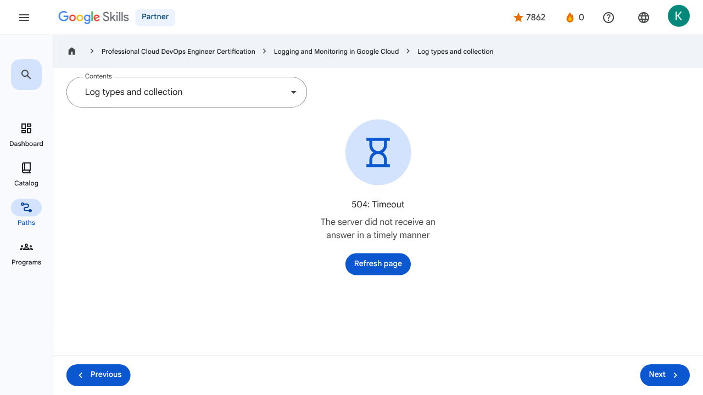

# Advanced Logging and Analysis - Log types and collection | Google Skills for Partners

---

## Metadata

- **URL:** https://partner.skills.google/paths/20/course_sessions/40490346/html_bundles/621229
- **Lesson type:** `html_bundles`
- **Path ID:** `20`
- **Container type:** `course_sessions`
- **Container ID:** `40490346`
- **Lesson ID:** `621229`
- **Generated:** 2026-07-13 04:00:31

---

## Open Human-Readable HTML

[Open readable_page.html](readable_page.html)

> README/GitHub Markdown usually blocks playable iframes. Open `readable_page.html` to see the playable YouTube frame and browser-like lesson page.

---

## Screenshot



---

## YouTube Video

_No YouTube video found._
---

## Transcript

_No transcript available for this page._
---

## Page Text

Partner
0
navigate_next
Professional Cloud DevOps Engineer Certification
navigate_next
Logging and Monitoring in Google Cloud
navigate_next
Log types and collection
Previous
Next
Recertify in 3 simple steps:
Link your Google Skills and certification account profiles using the same email to get started.
Instantly see which certifications are eligible for renewal.
Complete courses and skill badges to renew your certifications automatically.

By clicking "Accept", I consent to share my name, email, and course completion data with Google Skills' certification partner, CM Connect, to receive continuing education credit for certification renewal.

---

## Images

### Image 1


### Image 2


---

## Main Resources

### youtube

- [Youtube](https://www.youtube.com/@googlecloud)

### labs

- [Resource](https://support.google.com/qwiklabs/contact/Google_Skills_Partner)
- [Monitoring and Dashboarding Multiple Projects](https://partner.skills.google/paths/20/course_sessions/40490346/labs/621215)
- [Alerting in Google Cloud](https://partner.skills.google/paths/20/course_sessions/40490346/labs/621222)
- [Service Monitoring](https://partner.skills.google/paths/20/course_sessions/40490346/labs/621224)
- [Log Analytics on Google Cloud](https://partner.skills.google/paths/20/course_sessions/40490346/labs/621234)
- [Cloud Audit Logs](https://partner.skills.google/paths/20/course_sessions/40490346/labs/621242)

### external_links

- [Resource](https://partner.skills.google/)
- [Professional Cloud DevOps Engineer Certification](https://partner.skills.google/paths/20)
- [Logging and Monitoring in Google Cloud](https://partner.skills.google/paths/20/course_templates/99)
- [Dashboard](https://partner.skills.google/)
- [Catalog](https://partner.skills.google/catalog)
- [Paths](https://partner.skills.google/paths)
- [Subscriptions](https://partner.skills.google/subscriptions)
- [Activities](https://partner.skills.google/profile/stay_on_track)
- [Achievements](https://partner.skills.google/profile/badges)
- [Resource](https://partner.skills.google/profile/activity)
- [Resource](https://partner.skills.google/my_account/profile)
- [Programs](https://partner.skills.google/my_account/programs)
- [Overview](https://partner.skills.google/paths/20/course_templates/99)
- [Introduction to Google Cloud Observability](https://partner.skills.google/paths/20/course_sessions/40490346/html_bundles/621199)
- [Monitoring](https://partner.skills.google/paths/20/course_sessions/40490346/html_bundles/621200)
- [Need for Google Cloud observability](https://partner.skills.google/paths/20/course_sessions/40490346/html_bundles/621201)
- [Google Cloud Observability](https://partner.skills.google/paths/20/course_sessions/40490346/html_bundles/621202)
- [Cloud Monitoring](https://partner.skills.google/paths/20/course_sessions/40490346/html_bundles/621203)
- [Cloud Logging](https://partner.skills.google/paths/20/course_sessions/40490346/html_bundles/621204)
- [Error Reporting](https://partner.skills.google/paths/20/course_sessions/40490346/html_bundles/621205)
- [Application Performance Management Tools](https://partner.skills.google/paths/20/course_sessions/40490346/html_bundles/621206)
- [Module Summary](https://partner.skills.google/paths/20/course_sessions/40490346/html_bundles/621207)
- [Quiz - Introduction to Google Cloud Observability](https://partner.skills.google/paths/20/course_sessions/40490346/quizzes/621208)
- [Monitoring Overview](https://partner.skills.google/paths/20/course_sessions/40490346/html_bundles/621209)
- [Cloud Monitoring achitecture patterns](https://partner.skills.google/paths/20/course_sessions/40490346/html_bundles/621210)
- [Monitoring multiple projects](https://partner.skills.google/paths/20/course_sessions/40490346/html_bundles/621211)
- [Data model and dashboards](https://partner.skills.google/paths/20/course_sessions/40490346/html_bundles/621212)
- [Query metrics](https://partner.skills.google/paths/20/course_sessions/40490346/html_bundles/621213)
- [Uptime checks](https://partner.skills.google/paths/20/course_sessions/40490346/html_bundles/621214)
- [Module summary](https://partner.skills.google/paths/20/course_sessions/40490346/html_bundles/621216)
- [Quiz - Monitoring critical systems](https://partner.skills.google/paths/20/course_sessions/40490346/quizzes/621217)
- [Module Overview](https://partner.skills.google/paths/20/course_sessions/40490346/html_bundles/621218)
- [SLI, SLO, and SLA](https://partner.skills.google/paths/20/course_sessions/40490346/html_bundles/621219)
- [Developing an alerting strategy](https://partner.skills.google/paths/20/course_sessions/40490346/html_bundles/621220)
- [Creating alerts](https://partner.skills.google/paths/20/course_sessions/40490346/html_bundles/621221)
- [Service Monitoring](https://partner.skills.google/paths/20/course_sessions/40490346/html_bundles/621223)
- [Module summary](https://partner.skills.google/paths/20/course_sessions/40490346/html_bundles/621225)
- [Quiz - Alerting Policies](https://partner.skills.google/paths/20/course_sessions/40490346/quizzes/621226)
- [Module Overview](https://partner.skills.google/paths/20/course_sessions/40490346/html_bundles/621227)
- [Cloud Logging overview and architecture](https://partner.skills.google/paths/20/course_sessions/40490346/html_bundles/621228)
- [Log types and collection](https://partner.skills.google/paths/20/course_sessions/40490346/html_bundles/621229)
- [Storing, routing and exporting the logs](https://partner.skills.google/paths/20/course_sessions/40490346/html_bundles/621230)
- [Query and view logs](https://partner.skills.google/paths/20/course_sessions/40490346/html_bundles/621231)
- [Using log-based metrics](https://partner.skills.google/paths/20/course_sessions/40490346/html_bundles/621232)
- [Log analytics](https://partner.skills.google/paths/20/course_sessions/40490346/html_bundles/621233)
- [Module Summary](https://partner.skills.google/paths/20/course_sessions/40490346/html_bundles/621235)
- [Quiz - Advanced Logging and Analysis](https://partner.skills.google/paths/20/course_sessions/40490346/quizzes/621236)
- [Module Overview](https://partner.skills.google/paths/20/course_sessions/40490346/html_bundles/621237)
- [Cloud Audit Logs](https://partner.skills.google/paths/20/course_sessions/40490346/html_bundles/621238)
- [Data Access audit logs](https://partner.skills.google/paths/20/course_sessions/40490346/html_bundles/621239)
- [Audit logs entry format](https://partner.skills.google/paths/20/course_sessions/40490346/html_bundles/621240)
- [Best practices](https://partner.skills.google/paths/20/course_sessions/40490346/html_bundles/621241)
- [Module Summary](https://partner.skills.google/paths/20/course_sessions/40490346/html_bundles/621243)
- [Quiz - Working with Audit Logs](https://partner.skills.google/paths/20/course_sessions/40490346/quizzes/621244)
- [Course 1 Summary](https://partner.skills.google/paths/20/course_sessions/40490346/html_bundles/621245)
- [Course Resources](https://partner.skills.google/paths/20/course_sessions/40490346/documents/621246)
- [Claim credential](https://partner.skills.google/paths/20/course_templates/99/badge)
- [Course Survey
      Recommended](https://partner.skills.google/paths/20/course_templates/99/course_surveys/0)
- [Resource](https://partner.skills.google/paths/20/course_sessions/40490346/html_bundles/621228)
- [Resource](https://partner.skills.google/paths/20/course_sessions/40490346/html_bundles/621230)
- [Resource](https://partner.skills.google/paths/20/course_templates/99/preview)

---

## Headings

- **H2**: Recertify in 3 simple steps:
- **H1**: A newer version of this course is available. Your progress will carry over if you choose to upgrade. However, your completion percentage may change if the new version has added or removed any learning activities. Click the preview button to see the course changes before upgrading.
---

## Raw Files

- [readable_page.html](readable_page.html)
- [page.html](page.html)
- [page_text.txt](page_text.txt)
- [session.json](session.json)
- [headings.json](headings.json)
- [links.json](links.json)
- [images.json](images.json)
- [resources.json](resources.json)
- [youtube_links.json](youtube_links.json)
- [transcript.json](transcript.json)
- [transcript.txt](transcript.txt)
- [plugin_extra.json](plugin_extra.json)
- [screenshot.png](screenshot.png)

## Plugin Extra Data

```json
{
  "content_kind": "html_bundle"
}
```
