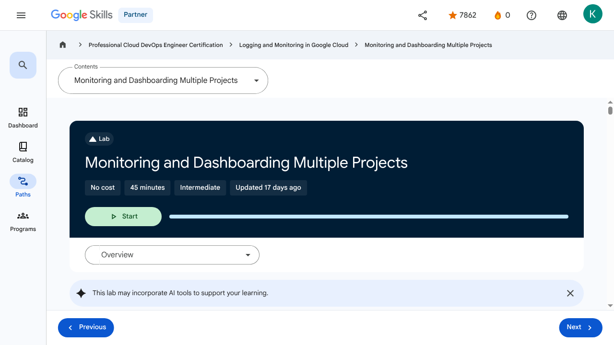
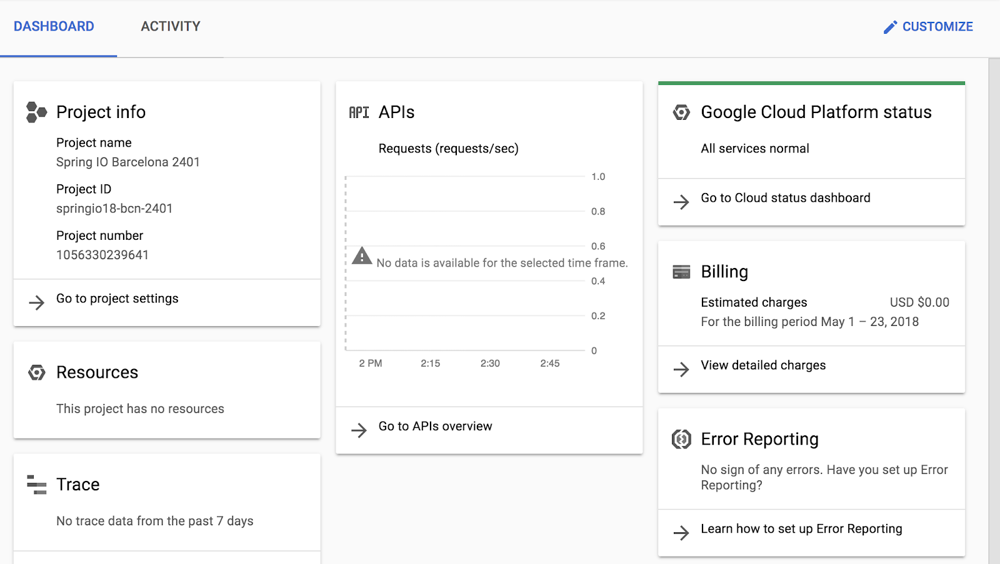
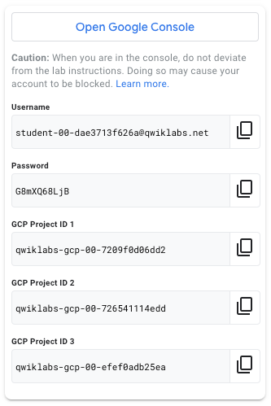
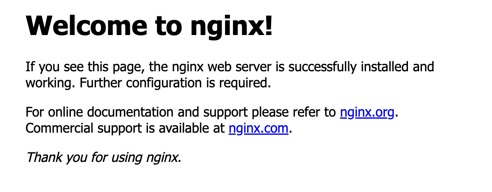

# Monitoring Critical Systems - Monitoring and Dashboarding Multiple Projects | Google Skills for Partners

> Offline lesson archive generated by Google Skills scraper.

---

## Metadata

- **Original URL:** https://partner.skills.google/paths/20/course_sessions/40490346/labs/621215
- **Lesson type:** `labs`
- **Path ID:** `20`
- **Container type:** `course_sessions`
- **Container ID:** `40490346`
- **Lesson ID:** `621215`
- **Generated:** 2026-07-13 04:05:15

---

## Full Page Screenshot



---

## Video

_No video found for this page._

---

## Transcript

_No transcript available._

---

## Lesson Text

Partner
0
navigate_next
Professional Cloud DevOps Engineer Certification
navigate_next
Logging and Monitoring in Google Cloud
navigate_next
Monitoring and Dashboarding Multiple Projects
This lab may incorporate AI tools to support your learning.
Overview

Cloud Monitoring empowers users with the ability to monitor multiple projects from a single metrics scope. In this exercise, you start with three Google Cloud projects, two with monitorable resources, and the third you use to host a metrics scope. You attach the two resource projects to the metrics scope, build uptime checks, and construct a centralized dashboard.

Objectives
Configure a Worker project.
Create a metrics scope and link the two worker projects into it.
Create and configure Monitoring Groups.
Create and test an uptime check.
Setup and requirements

For each lab, you get a new Google Cloud project and set of resources for a fixed time at no cost.

Click the Start Lab button. If you need to pay for the lab, a pop-up opens for you to select your payment method. On the right is the Lab setup and access panel with the following:

The Open Google Cloud console button
The temporary credentials (username and password) that you must use for this lab
Other information, if needed, to step through this lab

Note that the lab timer is located near the top of the page, showing the remaining time.

Click Open Google Cloud console (or right-click and select Open Link in Incognito Window if you are running the Chrome browser).

The lab spins up resources, and then opens another tab that shows the Sign in page.

Tip: Arrange the tabs in separate windows, side-by-side.

Note: If you see the Choose an account dialog, click Use Another Account.

If necessary, copy the Username below and paste it into the Sign in dialog.

You can also find the Username in the Lab setup and access panel.

Click Next.

Copy the Password below and paste it into the Welcome dialog.

You can also find the Password in the Lab setup and access panel.

Click Next.

Important: You must use the credentials the lab provides you. Do not use your Google Cloud account credentials.
Note: Using your own Google Cloud account for this lab may incur extra charges.

Click through the subsequent pages:

Accept the terms and conditions.
Do not add recovery options or two-factor authentication (because this is a temporary account).
Do not sign up for free trials.

After a few moments, the Google Cloud console opens in this tab.

Note: To view a menu with a list of Google Cloud products and services, click the Navigation menu at the top-left, or type the service or product name in the Search field. 

After you complete the initial sign-in steps, the project dashboard appears.

Activate Google Cloud Shell

Google Cloud Shell is a virtual machine that is loaded with development tools. It offers a persistent 5GB home directory and runs on the Google Cloud.

Google Cloud Shell provides command-line access to your Google Cloud resources.

In Cloud console, on the top right toolbar, click the Open Cloud Shell button.

Click Continue.

It takes a few moments to provision and connect to the environment. When you are connected, you are already authenticated, and the project is set to your PROJECT_ID. For example:

gcloud is the command-line tool for Google Cloud. It comes pre-installed on Cloud Shell and supports tab-completion.

You can list the active account name with this command:

Output:

Example output:

You can list the project ID with this command:

Output:

Example output:

Note: Full documentation of gcloud is available in the gcloud CLI overview guide .
Task 1. Configure the resource projects

Your lab environment has three projects pre-created in it, the project IDs are displayed in the upper-left corner of the lab steps page.

The first project (ID 1) will be the scoping project. Projects ID 2 and ID 3 will be the monitored/resource projects. Per Google's recommended best practices, the project we use to host the metrics scope will not be one of the projects actually housing monitored resources.

In this task, you:

Create an NGINX web server in each of your worker projects.
Configure two resource projects

Let's start by building some resources to monitor.

Open a text document on your computer and in it, make note of the three project IDs.

Label Project ID 1 as Monitoring Project.
Label Project ID 2 as Worker 1.
Label Project ID 3 as Worker 2.

In the rest of this exercise, the project IDs are referred to by these names.

In the Google Cloud console page, use the project dropdown near the upper-left corner of the interface to switch to the Worker 1 project. Remember, it is the project with the ID you labeled Worker 1 in the text file you created in Step 1.

Note: If you don't see all three projects, type qwiklabs in the search box and the missing projects should appear.

In the Google Cloud console, in the Navigation menu (), click Compute Engine > VM Instances.

This may take a minute to initialize for the first time.

To create a new instance, click Create Instance.

There are many parameters you can configure when creating a new instance. Use the following for this lab:

Field	Value	Additional Information
Name	worker-1-server	Name for the VM instance
Region		For more information about regions, see the Compute Engine guide, Regions and Zones.
Zone		Note: Remember the zone that you selected to use later. For more information about zones, see the Compute Engine guide, Regions and Zones.
Series	E2	Name of the series
Machine Type	2 vCPU	This is an (e2-medium), 2-CPU, 4GB RAM instance. Several machine types are available, ranging from micro instance types to 32-core/208GB RAM instance types. For more information, see the Compute Engine guide, About machine families. Note: A new project has a default resource quota, which may limit the number of CPU cores. You can request more when you work on projects outside this lab.
Boot Disk	New 10 GB balanced persistent disk OS Image: Debian GNU/Linux 12 (bookworm)	Several images are available, including Debian, Ubuntu, CoreOS, and premium images such as Red Hat Enterprise Linux and Windows Server. For more information, see Operating System documentation.
Firewall	Allow HTTP traffic	Select this option in order to access a web server that you install later. Note: This automatically creates a firewall rule to allow HTTP traffic on port 80.

Click Create.

It should take about a minute for the VM, worker-1-server, to be created. After worker-1-server is created, the VM Instances page lists it in the VM instances list.

To use SSH to connect to the VM, click SSH to the right of the instance name, worker-1-server.

This launches an SSH client directly from your browser. If prompted, click Authorize.

Note: Learn more about how to use SSH to connect to an instance from the Compute Engine guide, Connect to Linux VMs using Google tools.

Now you install an NGINX web server, one of the most popular web servers in the world, to connect your VM to something.

Update the OS:

Expected output:

Install NGINX:

Expected output:

Confirm that NGINX is running:

Expected output:

To see the web page, return to the Cloud console and click the External IP link in the row for your machine, or add the External IP value to http://EXTERNAL_IP/ in a new browser window or tab.

If you see a message that the site does not support a secure connection, click Continue to site. The default web page should open.

Use the project dropdown to switch to Worker 2 project.

Perform similar steps in Worker 2:

Create a VM instance with worker-2-server.
Allow HTTP traffic.
SSH the VM instance.
Install NGINX.

Use the project dropdown to switch back to Worker 1 project.

Use the Navigation menu to view your new Compute Engine > VM instances.

Copy the External IP and paste it in a new browser tab. Make sure you can see your new Worker 1 web server.

In the text file you created in Step 1, add a new entry worker-1-server, and next to it, paste your copied external IP.

Use the project dropdown to switch to Worker 2 project. You should still be on the VM instances page. Again:

Copy the External IP value.
Paste it in the browser and view the new server 2 home page
Add a new worker-2-server entry into your text file and add its IP.

To check your progress in this lab, click Check my progress below. A checkmark means you're successful.

Click Check my progress to verify the objective.Configure two resource projects

Task 2. Create a metrics scope and link the two worker projects into it

There are a number of ways you might want to configure the relationship between the host project doing the monitoring, and the project or projects being monitored.

In general, if you're going for the multiple projects being centrally monitored approach, then it's recommended that the monitoring project contains nothing but monitoring related resources and configurations. That's exactly the approach taken here.

In this task, you:

Configure the central monitoring link to the Worker 1 and 2 projects.
Configure the monitoring link to the Worker 1 and 2 projects

Use the project dropdown to switch to the Monitoring Project.

In the Google Cloud console, in the Navigation menu (), click View All Products > Observability > Monitoring.

Click Settings.

Click Metric scope, and then click Add GCP projects.

Click Select Projects and select the Worker 1 and Worker 2 projects.

Click Add projects.

Switch to the Dashboards page.

Note: If you don't see anything, refresh the page and after a minute or two, you'll see the Disks, Firewalls, Infrastructure Summary, and VM Instances from the other two projects.

Click VM Instances. Take a few minutes and explore the dashboard.

Click Dashboards and take a few minutes exploring the other available dashboards, especially Infrastructure Summary.

Task 3. Create and configure Monitoring groups

Cloud Monitoring lets you monitor a set of resources together as a single group. Groups can then be linked to alerting policies, dashboards, etc. Each metrics scope can support up to five-hundred groups and up to six layers of sub-groups. Groups can be created using a variety of criteria, including labels, regions, and applications.

You add a label component=frontend to each of the web servers as a way to track your servers that are externally facing. In this case, it also allow you to easily add them to the same group.

In this task, you:

Assign labels to the web servers to make them easier to track.
Create a resource group and place the servers into it.
Create a sub-group just for frontend dev servers.
Assign labels to your web servers to make them easier to track

In the Google Cloud console, in the Navigation menu (), click Cloud overview > Dashboard.

Use the project dropdown to switch to the Worker 1 project.

Use the Navigation menu to navigate to your Compute Engine > VM instances.

Click the link to navigate to the worker-1-server settings.

Click the Edit button.

Click the Manage labels button.

Click the +Add label button and create a label with the key component and the value frontend.

Click the +Add label button and create a label with the key stage and the value dev.

Click Save.

Save the configuration changes.

Use the project dropdown to switch to the Worker 2 project.

Perform similar tasks:

Edit the settings for the worker-2-server.
Click the Manage labels button.
Click the +Add label button and create a label with the key component and the value frontend.
Click the +Add label button and create a label with the key stage and the value test. (Note the test value)
Save the changes.
Create a resource group and place the servers into it

Use the project dropdown to switch to the Monitoring Project.

In the Navigation menu (), click View All Products > Observability > Monitoring.

In the left-hand menu, navigate to Groups.

Create a new monitoring group using the +Create Group link.

Name the group Frontend Servers.

For the criteria, use:

Setting	Value
Type	Tag
Tag	component
Operator	Equals
Value	frontend

Make sure that Resources Selected on the right hand of the page is displaying 2 VM Instances currently selected. If not, double-check your criteria.

Create the group.

Refresh the page and after a minute or so, you should see several metrics and charts for your two VMs.

Create a sub-group just for frontend dev servers

In the Frontend Servers group, locate the Subgroups section and click Create Subgroup.

Configure the subgroup with the following settings:

Setting	Value
Name	Frontend Dev
Criteria 1	
Type	Tag
Tag	component
Operator	Equals
Value	frontend
Click Done for the first criteria, then Add a criterion:
Setting	Value
Criteria 2	
Type	Tag
Tag	stage
Operator	Equals
value	dev

Click Done for the second criteria, then select the And combine criteria operator to join them.

Click Create.

Navigate back to the Groups home page. Notice how the Frontend Servers group can now be expanded to show its sub-group. The UI also displays a clickable link containing a little information about the types of resources contained by the group.

Click Check my progress to verify the objective.Create and configure Monitoring groups

Task 4. Create and test an uptime check

Google Cloud uptime checks test the liveliness of externally facing HTTP, HTTPS, or TCP applications by accessing said applications from multiple locations around the world. The subsequent report includes information on uptime, latency, and status. Uptime checks can also be used in alerting policies and dashboards.

In this task, you:

Create an uptime check for the Frontend Servers group.
Investigate out how an uptime check handles failure.
Create an uptime check for the Frontend Servers group

If you've already created a group that contains the same resources that need to be uptime checked, then it's easy to create a single uptime check for multiple servers.

In the Monitoring section of your Monitoring Project, click Uptime checks.

At the top of the page, follow the link to +Create Uptime Check.

Configure a new uptime check with the following settings (don't press Save yet):

Setting	Value
Protocol	HTTP
Resource Type	Instance
Applies To	Group
Group	Frontend Servers
Path	/
Check Frequency	1 minute

Click Continue, to leave other options as defaults.

Click Continue, in the Response Validation section.

If you like, in the Alert & Notification section, click Notification Channels dropdown and use Manage Notification Channels to add your email address as a valid notification option. The Alert will be enabled by default but won't actually notify anyone otherwise.

Click Continue.

Set Title as Frontend Servers Uptime.

Click Test and verify a 200 response.

Create the uptime check.

In the list of uptime checks, click your new Frontend Servers Uptime to view its dashboard.

Wait a few minutes and refresh. The dashboard populates information about the check results. Explore the charts and data.

On the right side of the page in the Configuration box, copy the Check ID value and paste it in your notes text file. It should read frontend-servers-uptime.

Check out how an uptime check handles failure

Our uptime check is working, but how about if there was a failure? Let's trigger a failure and investigate the resulting uptime check and alert behavior.

Make sure you have a few minutes of data in your uptime check's dashboard before proceeding.

Using the Navigation menu to navigate to the Cloud overview > Dashboard page.

Use the project dropdown to switch to the Worker 1 project.

Use the Navigation menu to navigate to your Compute Engine > VM instances.

Select the checkbox next to worker-1-server and Stop it running.

Refresh the VM instances page and wait until you see the server has stopped running.

Use the project dropdown to switch to the Monitoring Project.

In the Navigation menu (), click View All Products > Observability > Monitoring > Uptime checks > Frontend Servers Uptime.

Examine the Uptime Check Latency and the Passed Checks chart. It could take a minute for the failures to start displaying.

What can Cloud Monitoring, Logging, and Alerting tell us?

Navigate to Monitoring > Metrics explorer.

Click Select a metric dropdown, select VM Instance > Uptime_check > Check passed and click Apply. On a side note, after you investigate the Check passed metric, you might try searching for "uptime_check" will display some of the other metrics you might like to investigate.

Click ADD FILTER:

Setting	Value
Metric labels	checked_resource_id
Value	Select from dropdown

Take a moment to examine the results.

In the Navigation menu, click Logs Explorer.

Enable Show query, and delete anything there. Click All log names. Locate and add the uptime_checks log, then select Apply. Click Run query.

Expand and examine one of the log entries. What useful information does it provide?

In the same entry, examine the labels section and locate the check_id. Consult your text notes document and compare the id you recorded there. They should match.

In the Navigation menu (), click View All Products > Observability > Monitoring > Alerting.

Investigate the firing alert. If you added yourself as a notification channel, review the email.

Note: If a Monitoring group is created based on labels, then the group will keep checking for powered off server for 5 minutes. After 5 minutes, Google Cloud determines the server should no longer be counted as a member of the group.

This is important because if an uptime check is tied to the group, then it will only report failures while the group reports that missing server.

When the group quits reporting the off server, the uptime check quits checking for it, and suddenly the check starts passing again. This can be a real issue if you're not careful.

Click Check my progress to verify the objective.Create and test an uptime check

Task 5. Create a custom dashboard

There will be times when the humans running a Google Cloud system want to investigate its status. This may be related to curiosity, capacity planning, or perhaps in response to an alert.

Regardless, when data is expressed in chart form, as opposed to a list of items or values, it tends to be easier to spot trends, anomalies, and highs or lows. In this task, we add a chart for our developers to use as a way to track some of the happenings on the frontend servers.

In this task, you:

Create a developer dashboard and add an uptime chart to it.
Add and test a CPU utilization chart to the dashboard.
Create a developer dashboard and add an uptime chart to it

If you were interested in what was happening on your developer webserver, it would be helpful to have a dashboard of charts just for that single server. In this section, you create a dashboard with an uptime check summary chart.

In the Google Cloud console, in the Navigation menu (), click Cloud overview > Dashboard.

Use the project dropdown to switch to the Worker 1 project.

Use the Navigation menu to navigate to your Compute Engine > VM instances.

Select the checkbox next to worker-1-server and Start it running.

Use the project dropdown to switch to the Monitoring Project.

In the Navigation menu (), click View All Products > Observability > Monitoring > Dashboards.

At the top of the page, press +Create Custom Dashboard.

For New Dashboard Name, type Developer's Frontend.

Click + Add Widget and click Line chart.

Setting	Value
Widget Title	Dev Server Uptime
Select a metric	VM Instance > Uptime_check > check_passed

Click Apply.

Examine the values displayed on the chart. Our worker-1-server is our core development server. Take note of the checked_resource_id value from one of its check response rows. You must pick the value from a list in the next step.

Click Add Filter:

Setting	Value
Resource labels	instance_id
Value	Select from dropdown

For Aggregation select Configure Aligner, set the Alignment function to Count true.

Click the Plus icon (Add query element) and set Min interval period 5m.

Click Apply.

Add and test a CPU utilization chart to the dashboard

Another key piece of information about what's going on inside your development server is its CPU load. Overall it is nice to know what's happening with the NGINX server itself, but without the installation of the logging and monitoring agents, you can't do that yet.

Add another chart to our dashboard. Click + Add Widget and click Line chart.

In the Select a metric, search/select VM Instance > Instance > cpu utilization.

Click Apply.

Click Add Filter:

Setting	Value
Metric labels	instance_name
Value	worker-1-server

Click Apply.

Cloud Shell doesn't always work well as a platform for generating load test traffic, since it sometimes thinks you're doing something malicious and terminates your session. Use your second web server to generate the load instead. Expand the Navigation menu, right-click Compute Engine, and open the link in a new tab or window.

Use the project dropdown to switch to the Worker 2 project.

SSH into your worker-2-server.

Update the server's package database and install the apache2-utils. Apache Bench is a quick easy tool you can use to generate HTTP load:

Enter Y if asked "Do you want to continue? [Y/n]"

Before you use Bench, set up a URL to your server. Find your worker-1-server external IP in your notes file and use it to construct the URL environmental variable below. Don't omit the "http://":
Throw some load at your server. The following command executes 100 requests at a time and continues to do so up to a total of 100,000 requests. Don't miss the trailing "/" after the URL:
Once Bench finishes its run, wait a minute or so and then execute:
While the second series of traffic is generated, switch back to your dashboard. After a little time, you see the two distinct spikes in CPU load.

Click Check my progress to verify the objective.Create a custom dashboard

Review
Congratulations!

You now know how to set up a central project for monitoring other projects, can create monitoring resource groups, uptime checks, and custom dashboards. You are well on your way. Nice job.

End your lab

When you have completed your lab, click End Lab. Google Skills removes the resources you’ve used and cleans the account for you.

You will be given an opportunity to rate the lab experience. Select the applicable number of stars, type a comment, and then click Submit.

The number of stars indicates the following:

1 star = Very dissatisfied
2 stars = Dissatisfied
3 stars = Neutral
4 stars = Satisfied
5 stars = Very satisfied

You can close the dialog box if you don't want to provide feedback.

For feedback, suggestions, or corrections, please use the Support tab.

Copyright 2026 Google LLC All rights reserved. Google and the Google logo are trademarks of Google LLC. All other company and product names may be trademarks of the respective companies with which they are associated.

Previous
Next
Recertify in 3 simple steps:
Link your Google Skills and certification account profiles using the same email to get started.
Instantly see which certifications are eligible for renewal.
Complete courses and skill badges to renew your certifications automatically.

By clicking "Accept", I consent to share my name, email, and course completion data with Google Skills' certification partner, CM Connect, to receive continuing education credit for certification renewal.

Before you begin
Labs create a Google Cloud project and resources for a fixed time
Labs have a time limit and no pause feature. If you end the lab, you'll have to restart from the beginning.
On the top left of your screen, click Start lab to begin

This content is not currently available

We will notify you via email when it becomes available

Great!

We will contact you via email if it becomes available

One lab at a time

Confirm to end all existing labs and start this one

Use private browsing to run the lab
Using an Incognito or private browser window is the best way to run this lab. This prevents any conflicts between your personal account and the Student account, which may cause extra charges incurred to your personal account.
Additional Comments

Complete this quick step to start your lab.

---

## Images

### Image 1


### Image 2


### Image 3


### Image 4



### Image 5


### Image 6


### Image 7



### Image 8



### Image 9


### Image 10


### Image 11


### Image 12


### Image 13


### Image 14


### Image 15


### Image 16


### Image 17


### Image 18


---

## Main Resources

### youtube

- [Youtube](https://www.youtube.com/@googlecloud)

### labs

- [Resource](https://support.google.com/qwiklabs/contact/Google_Skills_Partner)
- [Monitoring and Dashboarding Multiple Projects](https://partner.skills.google/paths/20/course_sessions/40490346/labs/621215)
- [Alerting in Google Cloud](https://partner.skills.google/paths/20/course_sessions/40490346/labs/621222)
- [Service Monitoring](https://partner.skills.google/paths/20/course_sessions/40490346/labs/621224)
- [Log Analytics on Google Cloud](https://partner.skills.google/paths/20/course_sessions/40490346/labs/621234)
- [Cloud Audit Logs](https://partner.skills.google/paths/20/course_sessions/40490346/labs/621242)

### external_links

- [Resource](https://partner.skills.google/)
- [Professional Cloud DevOps Engineer Certification](https://partner.skills.google/paths/20)
- [Logging and Monitoring in Google Cloud](https://partner.skills.google/paths/20/course_templates/99)
- [gcloud CLI overview guide](https://cloud.google.com/sdk/gcloud)
- [Regions and Zones](https://cloud.google.com/compute/docs/zones)
- [About machine families](https://cloud.google.com/compute/docs/machine-types)
- [resource quota](https://cloud.google.com/compute/docs/resource-quotas)
- [Connect to Linux VMs using Google tools](https://cloud.google.com/compute/docs/instances/connecting-to-instance)
- [Dashboard](https://partner.skills.google/)
- [Catalog](https://partner.skills.google/catalog)
- [Paths](https://partner.skills.google/paths)
- [Subscriptions](https://partner.skills.google/subscriptions)
- [Activities](https://partner.skills.google/profile/stay_on_track)
- [Achievements](https://partner.skills.google/profile/badges)
- [https://partner.skills.google/catalog_lab/2647](https://partner.skills.google/catalog_lab/2647)
- [Resource](https://x.com/intent/tweet?text=Learn%20cloud%20tech%20through%20hands-on%20training%20on%20%23GoogleSkills%21&url=https%3A%2F%2Fpartner.skills.google%2Fcatalog_lab%2F2647%3Futm_medium%3Dsocial%26utm_source%3Dx%26utm_campaign%3Dql-social-share&hashtags=)
- [Resource](https://partner.skills.google/profile/activity)
- [Resource](https://partner.skills.google/my_account/profile)
- [Programs](https://partner.skills.google/my_account/programs)
- [Overview](https://partner.skills.google/paths/20/course_templates/99)
- [Introduction to Google Cloud Observability](https://partner.skills.google/paths/20/course_sessions/40490346/html_bundles/621199)
- [Monitoring](https://partner.skills.google/paths/20/course_sessions/40490346/html_bundles/621200)
- [Need for Google Cloud observability](https://partner.skills.google/paths/20/course_sessions/40490346/html_bundles/621201)
- [Google Cloud Observability](https://partner.skills.google/paths/20/course_sessions/40490346/html_bundles/621202)
- [Cloud Monitoring](https://partner.skills.google/paths/20/course_sessions/40490346/html_bundles/621203)
- [Cloud Logging](https://partner.skills.google/paths/20/course_sessions/40490346/html_bundles/621204)
- [Error Reporting](https://partner.skills.google/paths/20/course_sessions/40490346/html_bundles/621205)
- [Application Performance Management Tools](https://partner.skills.google/paths/20/course_sessions/40490346/html_bundles/621206)
- [Module Summary](https://partner.skills.google/paths/20/course_sessions/40490346/html_bundles/621207)
- [Quiz - Introduction to Google Cloud Observability](https://partner.skills.google/paths/20/course_sessions/40490346/quizzes/621208)
- [Monitoring Overview](https://partner.skills.google/paths/20/course_sessions/40490346/html_bundles/621209)
- [Cloud Monitoring achitecture patterns](https://partner.skills.google/paths/20/course_sessions/40490346/html_bundles/621210)
- [Monitoring multiple projects](https://partner.skills.google/paths/20/course_sessions/40490346/html_bundles/621211)
- [Data model and dashboards](https://partner.skills.google/paths/20/course_sessions/40490346/html_bundles/621212)
- [Query metrics](https://partner.skills.google/paths/20/course_sessions/40490346/html_bundles/621213)
- [Uptime checks](https://partner.skills.google/paths/20/course_sessions/40490346/html_bundles/621214)
- [Module summary](https://partner.skills.google/paths/20/course_sessions/40490346/html_bundles/621216)
- [Quiz - Monitoring critical systems](https://partner.skills.google/paths/20/course_sessions/40490346/quizzes/621217)
- [Module Overview](https://partner.skills.google/paths/20/course_sessions/40490346/html_bundles/621218)
- [SLI, SLO, and SLA](https://partner.skills.google/paths/20/course_sessions/40490346/html_bundles/621219)
- [Developing an alerting strategy](https://partner.skills.google/paths/20/course_sessions/40490346/html_bundles/621220)
- [Creating alerts](https://partner.skills.google/paths/20/course_sessions/40490346/html_bundles/621221)
- [Service Monitoring](https://partner.skills.google/paths/20/course_sessions/40490346/html_bundles/621223)
- [Module summary](https://partner.skills.google/paths/20/course_sessions/40490346/html_bundles/621225)
- [Quiz - Alerting Policies](https://partner.skills.google/paths/20/course_sessions/40490346/quizzes/621226)
- [Module Overview](https://partner.skills.google/paths/20/course_sessions/40490346/html_bundles/621227)
- [Cloud Logging overview and architecture](https://partner.skills.google/paths/20/course_sessions/40490346/html_bundles/621228)
- [Log types and collection](https://partner.skills.google/paths/20/course_sessions/40490346/html_bundles/621229)
- [Storing, routing and exporting the logs](https://partner.skills.google/paths/20/course_sessions/40490346/html_bundles/621230)
- [Query and view logs](https://partner.skills.google/paths/20/course_sessions/40490346/html_bundles/621231)
- [Using log-based metrics](https://partner.skills.google/paths/20/course_sessions/40490346/html_bundles/621232)
- [Log analytics](https://partner.skills.google/paths/20/course_sessions/40490346/html_bundles/621233)
- [Module Summary](https://partner.skills.google/paths/20/course_sessions/40490346/html_bundles/621235)
- [Quiz - Advanced Logging and Analysis](https://partner.skills.google/paths/20/course_sessions/40490346/quizzes/621236)
- [Module Overview](https://partner.skills.google/paths/20/course_sessions/40490346/html_bundles/621237)
- [Cloud Audit Logs](https://partner.skills.google/paths/20/course_sessions/40490346/html_bundles/621238)
- [Data Access audit logs](https://partner.skills.google/paths/20/course_sessions/40490346/html_bundles/621239)
- [Audit logs entry format](https://partner.skills.google/paths/20/course_sessions/40490346/html_bundles/621240)
- [Best practices](https://partner.skills.google/paths/20/course_sessions/40490346/html_bundles/621241)
- [Module Summary](https://partner.skills.google/paths/20/course_sessions/40490346/html_bundles/621243)
- [Quiz - Working with Audit Logs](https://partner.skills.google/paths/20/course_sessions/40490346/quizzes/621244)
- [Course 1 Summary](https://partner.skills.google/paths/20/course_sessions/40490346/html_bundles/621245)
- [Course Resources](https://partner.skills.google/paths/20/course_sessions/40490346/documents/621246)
- [Claim credential](https://partner.skills.google/paths/20/course_templates/99/badge)
- [Course Survey
      Recommended](https://partner.skills.google/paths/20/course_templates/99/course_surveys/0)
- [Resource](https://partner.skills.google/paths/20/course_sessions/40490346/html_bundles/621214)
- [Resource](https://partner.skills.google/paths/20/course_sessions/40490346/html_bundles/621216)
- [Resource](https://partner.skills.google/focuses/827494138/set_up_lab_forward_url?course_template=99&parent=course_session)
- [Resource](https://partner.skills.google/paths/20/course_templates/99/preview)

---

## Headings

- **H4**: Checkpoints
- **H1**: Monitoring and Dashboarding Multiple Projects
- **H2**: Overview
- **H3**: Objectives
- **H2**: Setup and requirements
- **H3**: Activate Google Cloud Shell
- **H2**: Task 1. Configure the resource projects
- **H3**: Configure two resource projects
- **H2**: Task 2. Create a metrics scope and link the two worker projects into it
- **H3**: Configure the monitoring link to the Worker 1 and 2 projects
- **H2**: Task 3. Create and configure Monitoring groups
- **H3**: Assign labels to your web servers to make them easier to track
- **H3**: Create a resource group and place the servers into it
- **H3**: Create a sub-group just for frontend dev servers
- **H2**: Task 4. Create and test an uptime check
- **H3**: Create an uptime check for the Frontend Servers group
- **H3**: Check out how an uptime check handles failure
- **H3**: What can Cloud Monitoring, Logging, and Alerting tell us?
- **H2**: Task 5. Create a custom dashboard
- **H3**: Create a developer dashboard and add an uptime chart to it
- **H3**: Add and test a CPU utilization chart to the dashboard
- **H2**: Review
- **H3**: Congratulations!
- **H2**: End your lab
- **H2**: Recertify in 3 simple steps:
- **H1**: Before you begin
- **H1**: Use private browsing
- **H1**: Sign in to the Console
- **H1**: Score Details
- **H1**: Use private browsing to run the lab
- **H1**: How satisfied are you with this lab?*
- **H1**: Are you sure? You may not be able to restart the lab, and you'll need to start from the beginning if you do.
- **H1**: Verify you're human
- **H1**: A newer version of this course is available. Your progress will carry over if you choose to upgrade. However, your completion percentage may change if the new version has added or removed any learning activities. Click the preview button to see the course changes before upgrading.

---

## Code Blocks / Commands

### Code Block 1

```
"Username"
```


### Code Block 2

```
"Password"
```


### Code Block 3

```
gcloud auth list
```


### Code Block 4

```
Credentialed accounts:
 - <myaccount>@<mydomain>.com (active)
</mydomain></myaccount>
```


### Code Block 5

```
Credentialed accounts:
 - google1623327_student@qwiklabs.net
```


### Code Block 6

```
gcloud config list project
```


### Code Block 7

```
[core]
project = <project_id>
</project_id>
```


### Code Block 8

```
[core]
project = qwiklabs-gcp-44776a13dea667a6
```


### Code Block 9

```
Worker 1
```


### Code Block 10

```
<REGION>
```


### Code Block 11

```
<ZONE>
```


### Code Block 12

```
worker-1-server
```


### Code Block 13

```
sudo apt-get update
```


### Code Block 14

```
Get:1 http://security.debian.org stretch/updates InRelease [94.3 kB]
 Ign http://deb.debian.org strech InRelease
 Get:2 http://deb.debian.org strech-updates InRelease [91.0 kB]
 ...
```


### Code Block 15

```
sudo apt-get install -y nginx
```


### Code Block 16

```
Reading package lists... Done
 Building dependency tree
 Reading state information... Done
 The following additional packages will be installed:
 ...
```


### Code Block 17

```
ps auwx | grep nginx
```


### Code Block 18

```
root      2330  0.0  0.0 159532  1628 ?        Ss   14:06   0:00 nginx: master process /usr/sbin/nginx -g daemon on; master_process on;
 www-data  2331  0.0  0.0 159864  3204 ?        S    14:06   0:00 nginx: worker process
 www-data  2332  0.0  0.0 159864  3204 ?        S    14:06   0:00 nginx: worker process
 root      2342  0.0  0.0  12780   988 pts/0    S+   14:07   0:00 grep nginx
```


### Code Block 19

```
http://EXTERNAL_IP/
```


### Code Block 20

```
Worker 2
```


### Code Block 21

```
External IP
```


### Code Block 22

```
VM instances
```


### Code Block 23

```
Monitoring Project
```


### Code Block 24

```
component=frontend
```


### Code Block 25

```
component
```


### Code Block 26

```
frontend
```


### Code Block 27

```
stage
```


### Code Block 28

```
dev
```


### Code Block 29

```
test
```


### Code Block 30

```
Frontend Servers
```


### Code Block 31

```
Resources Selected
```


### Code Block 32

```
Subgroups
```


### Code Block 33

```
Frontend Dev
```


### Code Block 34

```
Tag
```


### Code Block 35

```
Equals
```


### Code Block 36

```
Groups
```


### Code Block 37

```
HTTP
```


### Code Block 38

```
Instance
```


### Code Block 39

```
Group
```


### Code Block 40

```
/
```


### Code Block 41

```
1 minute
```


### Code Block 42

```
Frontend Servers Uptime
```


### Code Block 43

```
Configuration
```


### Code Block 44

```
Check ID
```


### Code Block 45

```
frontend-servers-uptime.
```


### Code Block 46

```
Uptime Check Latency
```


### Code Block 47

```
Passed Checks
```


### Code Block 48

```
Select a metric
```


### Code Block 49

```
ADD FILTER
```


### Code Block 50

```
checked_resource_id
```


### Code Block 51

```
Select from dropdown
```


### Code Block 52

```
labels
```


### Code Block 53

```
check_id.
```


### Code Block 54

```
Dev Server Uptime
```


### Code Block 55

```
VM Instance > Uptime_check > check_passed
```


### Code Block 56

```
Add Filter
```


### Code Block 57

```
instance_id
```


### Code Block 58

```
Alignment function
```


### Code Block 59

```
Min interval
```


### Code Block 60

```
instance_name
```


### Code Block 61

```
worker-2-server
```


### Code Block 62

```
sudo apt-get update
sudo apt-get install apache2-utils
```


### Code Block 63

```
Y
```


### Code Block 64

```
URL=http://[worker-1-server ip]
```


### Code Block 65

```
ab -s 120 -n 100000 -c 100 $URL/
```


### Code Block 66

```
ab -s 120 -n 500000 -c 500 $URL/
```


---

## Related Files

- [README.md](README.md)
- [lesson.md](lesson.md)
- [readable_page.html](readable_page.html)
- [page.html](page.html)
- [page_text.txt](page_text.txt)
- [transcript.txt](transcript.txt)
- [screenshot.png](screenshot.png)
- [assets/](assets/)
- [assets/](assets/)
