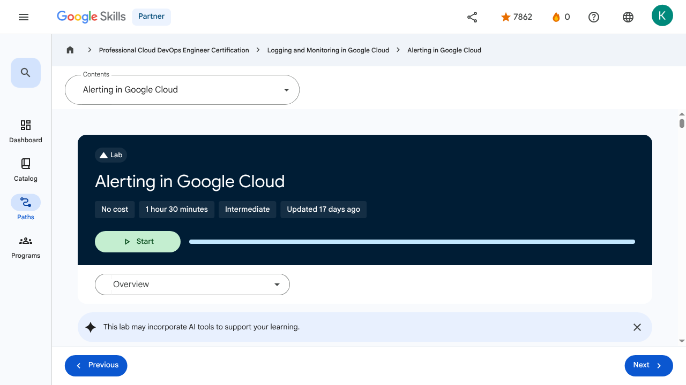

# Alerting Policies - Alerting in Google Cloud | Google Skills for Partners

---

## Metadata

- **URL:** https://partner.skills.google/paths/20/course_sessions/40490346/labs/621222
- **Lesson type:** `labs`
- **Path ID:** `20`
- **Container type:** `course_sessions`
- **Container ID:** `40490346`
- **Lesson ID:** `621222`
- **Generated:** 2026-07-13 04:05:52

---

## Open Human-Readable HTML

[Open readable_page.html](readable_page.html)

> README/GitHub Markdown usually blocks playable iframes. Open `readable_page.html` to see the playable YouTube frame and browser-like lesson page.

---

## Screenshot



---

## YouTube Video

_No YouTube video found._
---

## Transcript

_No transcript available for this page._
---

## Page Text

Partner
0
navigate_next
Professional Cloud DevOps Engineer Certification
navigate_next
Logging and Monitoring in Google Cloud
navigate_next
Alerting in Google Cloud
This lab may incorporate AI tools to support your learning.
Overview

In this lab, you deploy an application to App Engine and then create alerting policies to notify you if the application is not accessible or is generating errors.

Objectives

In this lab, you learn how to perform the following tasks:

Download a sample app from GitHub.
Deploy an application to App Engine.
Create uptime checks and alerts.
Optionally, create an alerting policy with the CLI.
Setup and requirements

For each lab, you get a new Google Cloud project and set of resources for a fixed time at no cost.

Click the Start Lab button. If you need to pay for the lab, a pop-up opens for you to select your payment method. On the right is the Lab setup and access panel with the following:

The Open Google Cloud console button
The temporary credentials (username and password) that you must use for this lab
Other information, if needed, to step through this lab

Note that the lab timer is located near the top of the page, showing the remaining time.

Click Open Google Cloud console (or right-click and select Open Link in Incognito Window if you are running the Chrome browser).

The lab spins up resources, and then opens another tab that shows the Sign in page.

Tip: Arrange the tabs in separate windows, side-by-side.

Note: If you see the Choose an account dialog, click Use Another Account.

If necessary, copy the Username below and paste it into the Sign in dialog.

You can also find the Username in the Lab setup and access panel.

Click Next.

Copy the Password below and paste it into the Welcome dialog.

You can also find the Password in the Lab setup and access panel.

Click Next.

Important: You must use the credentials the lab provides you. Do not use your Google Cloud account credentials.
Note: Using your own Google Cloud account for this lab may incur extra charges.

Click through the subsequent pages:

Accept the terms and conditions.
Do not add recovery options or two-factor authentication (because this is a temporary account).
Do not sign up for free trials.

After a few moments, the Google Cloud console opens in this tab.

Note: To view a menu with a list of Google Cloud products and services, click the Navigation menu at the top-left, or type the service or product name in the Search field. 

After you complete the initial sign-in steps, the project dashboard appears.

Activate Google Cloud Shell

Google Cloud Shell is a virtual machine that is loaded with development tools. It offers a persistent 5GB home directory and runs on the Google Cloud.

Google Cloud Shell provides command-line access to your Google Cloud resources.

In Cloud console, on the top right toolbar, click the Open Cloud Shell button.

Click Continue.

It takes a few moments to provision and connect to the environment. When you are connected, you are already authenticated, and the project is set to your PROJECT_ID. For example:

gcloud is the command-line tool for Google Cloud. It comes pre-installed on Cloud Shell and supports tab-completion.

You can list the active account name with this command:

Output:

Example output:

You can list the project ID with this command:

Output:

Example output:

Note: Full documentation of gcloud is available in the gcloud CLI overview guide .

Run the following commands to update the python environment

Task 1. Download and test a sample app from GitHub

Clone the Google Training Data Analyst from GitHub into your Cloud Shell environment. The repo contains a simple application which is perfect for the requirements in this exercise.

Once the cloning completes, change to the deploying-apps-to-gcp folder in the repository that contains our sample app:

Open the main.py file in the Cloud Shell editor. If prompted click Open in a new window. Take a moment to explore the basic "Hello GCP" Python Flask application.

Close the editor and switch back to the Cloud Shell terminal. Click Open terminal at the top right to open the Terminal window. To test the program, load all of the Python application dependencies and then start the app.

To see the program running, click the Web Preview button in the toolbar of Cloud Shell, and then select Preview on port 8080.

The program should open a new browser tab and display the Hello GCP message.

Close the tab and switch back to Cloud Shell, then press CTRL+C to exit the running Flask server.
Task 2. Deploy an application to App Engine

Now that we know the application works, let's deploy it to the App Engine.

Switch to (or reopen) the Cloud Shell code editor. Expand the training-data-analyst/courses/design-process/deploying-apps-to-gcp folder in the explorer tree on the left.

From the File menu, select New File and name the file app.yaml.

Paste the following into the file you just created:

To make sure the file is saved, select File > Save.

Every project needs to first create an App Engine application before it can be used. This is done just once per project using the console, or the gcloud app create command. Either way, you need to specify the region where you want the app to be created.

Execute the following command in your Cloud Shell terminal. You may have to Authorize Cloud Shell to make such a change:

Deploy the basic application to App Engine. The following command looks in the current directory for the application. It sees the app.yaml file declaring it a Python application and it assumes the rest of the folder contains the application itself, with a starting point in main.py. It loads the dependencies, packages the application, and deploys into the App Engine as a Service.

Wait for the application to finish deploying.

In the Google Cloud console window, in the Navigation menu (), click View all products > Serverless > App Engine > Dashboard.

In the upper right of the dashboard, you see a link to your application similar to what is shown below.

Note: By default, the URL to an App Engine is the form of https://project-id.wl.r.appspot.com.

Click the link to test your newly deployed app. It should function exactly like it did when we ran it in Cloud Shell.

Click refresh a number of times so Google Cloud can gather some sample data.

Click Check my progress to verify the objective.Deploy an application to App Engine.

Task 3. Examine the App Engine logs

Switch back to the Console and on the left side under App Engine, click the Versions link.

Select Logs from the Diagnose column.

In the logs, you see the requests you just made. If you get here too fast, wait a few seconds and click the Jump to Now button.
Task 4. Create an App Engine latency alert

Now that we have the application running, let's create an alert to watch for unusually high latency. To start, let's explore our application's current latency.

Check current application latency in Metrics explorer

In the Google Cloud console, in the Navigation menu, click View all products, Observability > Monitoring > Metrics explorer.

Click on Select a metric drop-down and uncheck the Active option.

Set the Metric to GAE Application > Http > Response latency. Click Apply. Make sure the metric is an App Engine metric, and not an uptime check metric. Because we don't currently have an uptime check, the second option won't work.

In the Aggregation field click on the dropdown and select 99th percentile.

Take a moment and examine the chart.

We don't have a lot of data but we should have enough to display a chart line showing us the average time it took our application to return a response to the fastest 99% of requests, cutting off 1% of anomalies.

Create an alert based on the same metric

Our application is performing as expected now. There may have been a few slow responses when the application was first launched, but on average, you should be seeing response times under 200ms.

Let's create an alert to notify us if we have response times over 5s for more than a minute.

In the Google Cloud console, on the Navigation menu (), click View all products > Observability > Monitoring > Alerting.

At the top, click Edit Notification Channels and scroll to the Email section. Use Add New to add your email address as a valid notification channel. For Display name , choose any name and then click Save.

Switch back to the main Alerting page and click Create policy.

Click Select a metric and uncheck the Active option to display the same metric explorer page. Once again, set the Metric to GAE Application > Http > Response latency. Click Apply. Set rolling window to 1 min and then click Next.

You'll notice the new Configuration section that's been added to the standard Metrics explorer window in the lower left.

Set up a condition so that if Any time series violates the Threshold position is Above threshold and Threshold value to 8000ms, it should trigger an alert.

Set the condition name to Response latency [MEAN] for 99th% over 8s.

Take a moment to examine the alert's chart. It's the same chart we created earlier with the Metrics explorer, but this time there should be an alert line drawn at 8s.

Click Next.

For Notifications and name, expand the Notification Channel and check yourself, click OK (the notification channel you created earlier in this section).

Name the alert Hello too slow and click Next. Review alert and click Create Policy.

Update the application code to add a delay. Return to the Cloud Shell code editor. Expand the training-data-analyst/courses/design-process/deploying-apps-to-gcp folder in the explorer tree on the left.

Click main.py to open it in the editor. Near the top at line 2, add the following imports statements (some will be used later in the exercise):

Replace the current main() function with the one below. This new version adds a sleep command which pauses the code for 10s in the middle of each request. This will be well over the threshold.

Now re-deploy your application by rerunning:

Wait for the command to finish the re-deployment.

After the command completes, return to Serverless > App Engine > Dashboard and make sure the link works.

To generate some consistent load, in Cloud Shell, enter the following command:

Note: This command makes requests to the App Engine app continuously in a loop. The grep command will display the title of the page when the request works. It also displays the error, if it doesn’t work. Every iteration, the thread sleeps a random amount of time less than a second, but with the 10s response time delay it will seem much longer.

Wait and after a few minutes (typically about 5), you should receive an email notifying you of the alert. When you do, switch back to the Cloud Shell terminal and use CTRL+C to stop the load tester loop.

In the Google Cloud console, on the Navigation menu (), click View all products > Observability > Monitoring > Alerting.

Notice the firing alert and how it created an incident.

Click the incident to view details.

Investigate the details page, scroll to the top and select Acknowledge incident.

Switch back to the main Alerting page and notice the changes.

Click Check my progress to verify the objective.Create an App Engine latency alert.

Task 5. (Optional) Creating an Alerting Policy with the CLI

The Alerting CLI (and API) can be very effective when applying alerting policies with code or scripts.

Return to the Cloud Shell code editor. Select the training-data-analyst/courses/design-process/deploying-apps-to-gcp folder in the explorer tree on the left.

From the File menu, select New File and name the file app-engine-error-percent-policy.json.

Create an alerting policy which divides the number of 500 errors by the total number of responses, then triggers when the 500 errors exceed 1 percent. Paste the following into the file you just created:

Save your file. Make sure you are in the correct folder and that your alerting policy was saved there.

Deploy the alerting policy with the following command:

In the Google Cloud console, on the Navigation menu (), click Observability > Monitoring > Alerting. In the Policies section, you should see the alerting policy you just deployed.

Click your HTTP error… policy to see its details. Edit the notification channel so you receive an email when the alert fires.

Deploy the App Engine app with a random error to test this policy. Return to the Cloud Shell code editor. Expand the training-data-analyst/courses/design-process/deploying-apps-to-gcp folder in the explorer tree on the left.

Open the main.py file in the Cloud Shell editor.

Replace the current main() function with the one below. This new function removes our sleep command and uses the random number generator to return a 500 error about 2% of the time. This should be enough to cause your HTTP error count policy to trigger.

Redeploy your application with the following command:

Wait for the command to finish the redeployment.

After the command completes, return to the App Engine > Dashboard and make sure the link works.

In Cloud Shell, rerun the load generator command from earlier:

In Cloud Shell, you should see an error appear randomly about 2% of the time. Leave the command running.

In the Google Cloud console, on the Navigation menu (), click Observability > Monitoring > Alerting, and wait another few minutes. You should see an alerting incident fire. You should also get an email. This won’t happen immediately, you have to be patient.

Once you get the email and see the incident fire, go back to Cloud Shell and press CTRL+C to stop the requests.

If you wait a couple more minutes, you see the incident resolve itself and get another email.

To make sure you don’t get any emails after the project is deleted, delete your notification channels. Click the HTTP error count… policy to see its details. Click the Edit link, expand the Notification Channel and uncheck yourself. Toggle off Use notification channel. Save your changes and then Delete the policy.

Repeat the previous step to your Uptime check alerting policy.

Review

In this exercise, you used the Google Cloud Console and CLI to create and test alerting policies. Good job!

End your lab

When you have completed your lab, click End Lab. Google Skills removes the resources you’ve used and cleans the account for you.

You will be given an opportunity to rate the lab experience. Select the applicable number of stars, type a comment, and then click Submit.

The number of stars indicates the following:

1 star = Very dissatisfied
2 stars = Dissatisfied
3 stars = Neutral
4 stars = Satisfied
5 stars = Very satisfied

You can close the dialog box if you don't want to provide feedback.

For feedback, suggestions, or corrections, please use the Support tab.

Copyright 2026 Google LLC All rights reserved. Google and the Google logo are trademarks of Google LLC. All other company and product names may be trademarks of the respective companies with which they are associated.

Previous
Next
Recertify in 3 simple steps:
Link your Google Skills and certification account profiles using the same email to get started.
Instantly see which certifications are eligible for renewal.
Complete courses and skill badges to renew your certifications automatically.

By clicking "Accept", I consent to share my name, email, and course completion data with Google Skills' certification partner, CM Connect, to receive continuing education credit for certification renewal.

Before you begin
Labs create a Google Cloud project and resources for a fixed time
Labs have a time limit and no pause feature. If you end the lab, you'll have to restart from the beginning.
On the top left of your screen, click Start lab to begin

This content is not currently available

We will notify you via email when it becomes available

Great!

We will contact you via email if it becomes available

One lab at a time

Confirm to end all existing labs and start this one

Use private browsing to run the lab
Using an Incognito or private browser window is the best way to run this lab. This prevents any conflicts between your personal account and the Student account, which may cause extra charges incurred to your personal account.
Additional Comments

Complete this quick step to start your lab.

---

## Images

### Image 1


### Image 2


### Image 3


### Image 4


### Image 5


### Image 6


### Image 7


### Image 8


### Image 9


### Image 10


### Image 11


### Image 12


### Image 13


### Image 14


### Image 15


### Image 16


### Image 17


### Image 18


### Image 19


---

## Main Resources

### youtube

- [Youtube](https://www.youtube.com/@googlecloud)

### labs

- [Resource](https://support.google.com/qwiklabs/contact/Google_Skills_Partner)
- [Monitoring and Dashboarding Multiple Projects](https://partner.skills.google/paths/20/course_sessions/40490346/labs/621215)
- [Alerting in Google Cloud](https://partner.skills.google/paths/20/course_sessions/40490346/labs/621222)
- [Service Monitoring](https://partner.skills.google/paths/20/course_sessions/40490346/labs/621224)
- [Log Analytics on Google Cloud](https://partner.skills.google/paths/20/course_sessions/40490346/labs/621234)
- [Cloud Audit Logs](https://partner.skills.google/paths/20/course_sessions/40490346/labs/621242)

### external_links

- [Resource](https://partner.skills.google/)
- [Professional Cloud DevOps Engineer Certification](https://partner.skills.google/paths/20)
- [Logging and Monitoring in Google Cloud](https://partner.skills.google/paths/20/course_templates/99)
- [gcloud CLI overview guide](https://cloud.google.com/sdk/gcloud)
- [Dashboard](https://partner.skills.google/)
- [Catalog](https://partner.skills.google/catalog)
- [Paths](https://partner.skills.google/paths)
- [Subscriptions](https://partner.skills.google/subscriptions)
- [Activities](https://partner.skills.google/profile/stay_on_track)
- [Achievements](https://partner.skills.google/profile/badges)
- [https://partner.skills.google/catalog_lab/2645](https://partner.skills.google/catalog_lab/2645)
- [Resource](https://x.com/intent/tweet?text=Learn%20cloud%20tech%20through%20hands-on%20training%20on%20%23GoogleSkills%21&url=https%3A%2F%2Fpartner.skills.google%2Fcatalog_lab%2F2645%3Futm_medium%3Dsocial%26utm_source%3Dx%26utm_campaign%3Dql-social-share&hashtags=)
- [Resource](https://partner.skills.google/profile/activity)
- [Resource](https://partner.skills.google/my_account/profile)
- [Programs](https://partner.skills.google/my_account/programs)
- [Overview](https://partner.skills.google/paths/20/course_templates/99)
- [Introduction to Google Cloud Observability](https://partner.skills.google/paths/20/course_sessions/40490346/html_bundles/621199)
- [Monitoring](https://partner.skills.google/paths/20/course_sessions/40490346/html_bundles/621200)
- [Need for Google Cloud observability](https://partner.skills.google/paths/20/course_sessions/40490346/html_bundles/621201)
- [Google Cloud Observability](https://partner.skills.google/paths/20/course_sessions/40490346/html_bundles/621202)
- [Cloud Monitoring](https://partner.skills.google/paths/20/course_sessions/40490346/html_bundles/621203)
- [Cloud Logging](https://partner.skills.google/paths/20/course_sessions/40490346/html_bundles/621204)
- [Error Reporting](https://partner.skills.google/paths/20/course_sessions/40490346/html_bundles/621205)
- [Application Performance Management Tools](https://partner.skills.google/paths/20/course_sessions/40490346/html_bundles/621206)
- [Module Summary](https://partner.skills.google/paths/20/course_sessions/40490346/html_bundles/621207)
- [Quiz - Introduction to Google Cloud Observability](https://partner.skills.google/paths/20/course_sessions/40490346/quizzes/621208)
- [Monitoring Overview](https://partner.skills.google/paths/20/course_sessions/40490346/html_bundles/621209)
- [Cloud Monitoring achitecture patterns](https://partner.skills.google/paths/20/course_sessions/40490346/html_bundles/621210)
- [Monitoring multiple projects](https://partner.skills.google/paths/20/course_sessions/40490346/html_bundles/621211)
- [Data model and dashboards](https://partner.skills.google/paths/20/course_sessions/40490346/html_bundles/621212)
- [Query metrics](https://partner.skills.google/paths/20/course_sessions/40490346/html_bundles/621213)
- [Uptime checks](https://partner.skills.google/paths/20/course_sessions/40490346/html_bundles/621214)
- [Module summary](https://partner.skills.google/paths/20/course_sessions/40490346/html_bundles/621216)
- [Quiz - Monitoring critical systems](https://partner.skills.google/paths/20/course_sessions/40490346/quizzes/621217)
- [Module Overview](https://partner.skills.google/paths/20/course_sessions/40490346/html_bundles/621218)
- [SLI, SLO, and SLA](https://partner.skills.google/paths/20/course_sessions/40490346/html_bundles/621219)
- [Developing an alerting strategy](https://partner.skills.google/paths/20/course_sessions/40490346/html_bundles/621220)
- [Creating alerts](https://partner.skills.google/paths/20/course_sessions/40490346/html_bundles/621221)
- [Service Monitoring](https://partner.skills.google/paths/20/course_sessions/40490346/html_bundles/621223)
- [Module summary](https://partner.skills.google/paths/20/course_sessions/40490346/html_bundles/621225)
- [Quiz - Alerting Policies](https://partner.skills.google/paths/20/course_sessions/40490346/quizzes/621226)
- [Module Overview](https://partner.skills.google/paths/20/course_sessions/40490346/html_bundles/621227)
- [Cloud Logging overview and architecture](https://partner.skills.google/paths/20/course_sessions/40490346/html_bundles/621228)
- [Log types and collection](https://partner.skills.google/paths/20/course_sessions/40490346/html_bundles/621229)
- [Storing, routing and exporting the logs](https://partner.skills.google/paths/20/course_sessions/40490346/html_bundles/621230)
- [Query and view logs](https://partner.skills.google/paths/20/course_sessions/40490346/html_bundles/621231)
- [Using log-based metrics](https://partner.skills.google/paths/20/course_sessions/40490346/html_bundles/621232)
- [Log analytics](https://partner.skills.google/paths/20/course_sessions/40490346/html_bundles/621233)
- [Module Summary](https://partner.skills.google/paths/20/course_sessions/40490346/html_bundles/621235)
- [Quiz - Advanced Logging and Analysis](https://partner.skills.google/paths/20/course_sessions/40490346/quizzes/621236)
- [Module Overview](https://partner.skills.google/paths/20/course_sessions/40490346/html_bundles/621237)
- [Cloud Audit Logs](https://partner.skills.google/paths/20/course_sessions/40490346/html_bundles/621238)
- [Data Access audit logs](https://partner.skills.google/paths/20/course_sessions/40490346/html_bundles/621239)
- [Audit logs entry format](https://partner.skills.google/paths/20/course_sessions/40490346/html_bundles/621240)
- [Best practices](https://partner.skills.google/paths/20/course_sessions/40490346/html_bundles/621241)
- [Module Summary](https://partner.skills.google/paths/20/course_sessions/40490346/html_bundles/621243)
- [Quiz - Working with Audit Logs](https://partner.skills.google/paths/20/course_sessions/40490346/quizzes/621244)
- [Course 1 Summary](https://partner.skills.google/paths/20/course_sessions/40490346/html_bundles/621245)
- [Course Resources](https://partner.skills.google/paths/20/course_sessions/40490346/documents/621246)
- [Claim credential](https://partner.skills.google/paths/20/course_templates/99/badge)
- [Course Survey
      Recommended](https://partner.skills.google/paths/20/course_templates/99/course_surveys/0)
- [Resource](https://partner.skills.google/paths/20/course_sessions/40490346/html_bundles/621221)
- [Resource](https://partner.skills.google/paths/20/course_sessions/40490346/html_bundles/621223)
- [Resource](https://partner.skills.google/focuses/827494145/set_up_lab_forward_url?course_template=99&parent=course_session)
- [Resource](https://partner.skills.google/paths/20/course_templates/99/preview)

---

## Headings

- **H4**: Checkpoints
- **H1**: Alerting in Google Cloud
- **H2**: Overview
- **H3**: Objectives
- **H2**: Setup and requirements
- **H3**: Activate Google Cloud Shell
- **H2**: Task 1. Download and test a sample app from GitHub
- **H2**: Task 2. Deploy an application to App Engine
- **H2**: Task 3. Examine the App Engine logs
- **H2**: Task 4. Create an App Engine latency alert
- **H3**: Check current application latency in Metrics explorer
- **H3**: Create an alert based on the same metric
- **H2**: Task 5. (Optional) Creating an Alerting Policy with the CLI
- **H2**: Review
- **H2**: End your lab
- **H2**: Recertify in 3 simple steps:
- **H1**: Before you begin
- **H1**: Use private browsing
- **H1**: Sign in to the Console
- **H1**: Score Details
- **H1**: Use private browsing to run the lab
- **H1**: How satisfied are you with this lab?*
- **H1**: Are you sure? You may not be able to restart the lab, and you'll need to start from the beginning if you do.
- **H1**: Verify you're human
- **H1**: A newer version of this course is available. Your progress will carry over if you choose to upgrade. However, your completion percentage may change if the new version has added or removed any learning activities. Click the preview button to see the course changes before upgrading.
---

## Raw Files

- [readable_page.html](readable_page.html)
- [page.html](page.html)
- [page_text.txt](page_text.txt)
- [session.json](session.json)
- [headings.json](headings.json)
- [links.json](links.json)
- [images.json](images.json)
- [resources.json](resources.json)
- [youtube_links.json](youtube_links.json)
- [transcript.json](transcript.json)
- [transcript.txt](transcript.txt)
- [plugin_extra.json](plugin_extra.json)
- [screenshot.png](screenshot.png)

## Plugin Extra Data

```json
{
  "content_kind": "lab"
}
```
