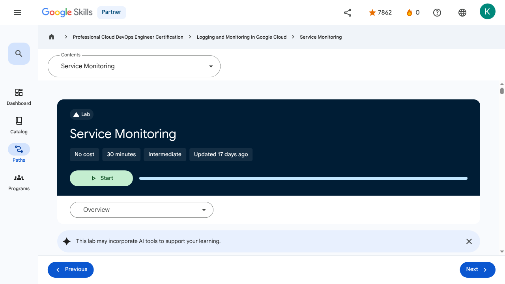

# Alerting Policies - Service Monitoring | Google Skills for Partners

---

## Metadata

- **URL:** https://partner.skills.google/paths/20/course_sessions/40490346/labs/621224
- **Lesson type:** `labs`
- **Path ID:** `20`
- **Container type:** `course_sessions`
- **Container ID:** `40490346`
- **Lesson ID:** `621224`
- **Generated:** 2026-07-13 04:06:22

---

## Open Human-Readable HTML

[Open readable_page.html](readable_page.html)

> README/GitHub Markdown usually blocks playable iframes. Open `readable_page.html` to see the playable YouTube frame and browser-like lesson page.

---

## Screenshot



---

## YouTube Video

_No YouTube video found._
---

## Transcript

_No transcript available for this page._
---

## Page Text

Partner
0
navigate_next
Professional Cloud DevOps Engineer Certification
navigate_next
Logging and Monitoring in Google Cloud
navigate_next
Service Monitoring
This lab may incorporate AI tools to support your learning.
Overview

Google Cloud's Service Monitoring streamlines the creation of microservice Service Level Objectives (SLOs) based on availability, latency, or custom Service Level Indicators (SLIs). In this lab, you use Service Monitoring to create a 99.5% availability SLO and corresponding alert.

Objectives

In this lab, you learn how to perform the following tasks:

Deploy a test application.
Use Service Monitoring to create an SLO.
Tie an alert to the SLO.
Setup and requirements
Access your lab

For each lab, you get a new Google Cloud project and set of resources for a fixed time at no cost.

Click the Start Lab button. If you need to pay for the lab, a pop-up opens for you to select your payment method. On the right is the Lab setup and access panel with the following:

The Open Google Cloud console button
The temporary credentials (username and password) that you must use for this lab
Other information, if needed, to step through this lab

Note that the lab timer is located near the top of the page, showing the remaining time.

Click Open Google Cloud console (or right-click and select Open Link in Incognito Window if you are running the Chrome browser).

The lab spins up resources, and then opens another tab that shows the Sign in page.

Tip: Arrange the tabs in separate windows, side-by-side.

Note: If you see the Choose an account dialog, click Use Another Account.

If necessary, copy the Username below and paste it into the Sign in dialog.

You can also find the Username in the Lab setup and access panel.

Click Next.

Copy the Password below and paste it into the Welcome dialog.

You can also find the Password in the Lab setup and access panel.

Click Next.

Important: You must use the credentials the lab provides you. Do not use your Google Cloud account credentials.
Note: Using your own Google Cloud account for this lab may incur extra charges.

Click through the subsequent pages:

Accept the terms and conditions.
Do not add recovery options or two-factor authentication (because this is a temporary account).
Do not sign up for free trials.

After a few moments, the Google Cloud console opens in this tab.

Note: To view a menu with a list of Google Cloud products and services, click the Navigation menu at the top-left, or type the service or product name in the Search field. 
Activate Google Cloud Shell

Google Cloud Shell is a virtual machine that is loaded with development tools. It offers a persistent 5GB home directory and runs on the Google Cloud.

Google Cloud Shell provides command-line access to your Google Cloud resources.

In Cloud console, on the top right toolbar, click the Open Cloud Shell button.

Click Continue.

It takes a few moments to provision and connect to the environment. When you are connected, you are already authenticated, and the project is set to your PROJECT_ID. For example:

gcloud is the command-line tool for Google Cloud. It comes pre-installed on Cloud Shell and supports tab-completion.

You can list the active account name with this command:

Output:

Example output:

You can list the project ID with this command:

Output:

Example output:

Note: Full documentation of gcloud is available in the gcloud CLI overview guide .
Task 1. Deploy a test application

In this task, you deploy a test application to App Engine.

Deploy a test application to App Engine

To have something for Service Monitoring to connect to, deploy a basic Node.js application to App Engine standard.

In your Cloud Shell terminal, clone https://github.com/haggman/HelloLoggingNodeJS.git repo:

This repository contains a basic Node.js web application used for testing. This is the same application you saw pieces of in the lecture module.

Change into the HelloLoggingNodeJS folder and open the index.js in the Cloud Shell code editor:
Note: If an error indicates that the code editor could not be loaded because third-party cookies are disabled, click Open in New Window and switch to the new tab.

Take a few minutes to peruse the code.

In the cloud shell code editor, look at the app.yaml file. And update the runtime nodejs version.

App Engine standard uses this file to define the runtime required by the application.

In the cloud shell code editor, look at the package.json file.

Not only does this define the Node.js application dependencies, but it also defines the start script App Engine uses to serve requests.

Return to the Cloud Shell window. If the Cloud Shell is not visible, click Open Terminal.

In the Cloud Shell terminal, create a new App Engine app:

This must be done once in each new project that is running App Engine applications. App Engine is a regional technology, thus the region switch.

Deploy the Hello Logging app to App Engine:

Wait until the deploy completes before moving on.

When prompted, type y and press Enter.

Copy the URL to your newly deployed app from the console (https://qwiklabs-gcp-****************.appspot.com) and open it in a new browser tab.

Verify a Hello World! response.

Click Check my progress to verify the objective.Deploy an application to App Engine.

Task 2. Use Service Monitoring to create an availability SLO

In this task, you:

Use Service Monitoring to create an availability SLO.
Create an alert tied to your SLO.
Trigger the alert.
Place some load on the application

At the top of the Cloud Shell interface, press the Add icon to Open a new tab.

In the new tab, use a simple bash while loop to generate load on your application:

The loop generates ten requests per second. The URL is to the /random-error route, which generates an error about every 1000 requests, so you should see approximately 1 error every 100s.

Leave the loop running in its Cloud Shell tab and move on to the next step.
Use Service Monitoring to create an availability SLO

We have a working App Engine application that is currently throwing an error approximately every 1000 requests. Imagine we want to create an availability SLO with a target of 99.5%, and an alert that will notify us if our SLO is in danger. That's exactly what Service Monitoring makes easy.

In the Google Cloud Console, use the Navigation menu () to navigate to App Engine | Dashboard. You can already see information on your running service and the load you are placing on it.

Scroll down to the Server Errors section. Have any errors been generated yet? If not, wait a couple of minutes and refresh the page. You should see one every few minutes.

Use the Navigation menu to navigate to Error Reporting.

Notice the error is also being caught here. We will discuss Error Reporting in a later module.

Use the Navigation menu to navigate to Monitoring.

It takes a moment for the monitoring workspace to create.

Once it loads, click SLOs.

Notice that Service Monitoring already sees your default App Engine application. "If it doesn't, wait a minute, refresh the page and click +Define a service, select default, and submit it."

Click the default App Engine application to drill into it.

Click +Create SLO to start the new SLO dialog.

Select the Availability metric, leave the evaluation method set to Request-based, and then click Continue.

Take a moment to investigate the details the SLI details displayed, then click Continue.

To define the SLO, set the Period type to Rolling and the Period length to 7 days to calculate the SLO on a constantly moving 7-day window of time.

Set the Goal to 99.5% and the charts fill in, though it's typically difficult to see that 99.5 to 99.9 difference.

Click the red dashed line, and the chart will zoom in to make things easier to see.

Click Continue, notice the default name, and submit the new SLO by clicking Create SLO.

Investigate the new SLO and create an alert for it
Under the Current status of 1 SLO section, expand the new SLO and investigate the information it displays. Move between the three tabs, Service level indicator, Error budget, and Alerts firing, investigating each.

Create an alert tied to the availability SLO

The SLO has been created and so far, you are well within your objective. Since the SLO target is 99.5%, and the SLI should be showing a current measurement level of about 99.9%, that means that your application is using approximately 1/5 of its error budget, so the error budget should be displaying about 80%. If you start to burn through your error budget at an unexpectedly fast rate, it would be nice for an alert to fire to let you know.

There are several ways to create an alert for an SLO in Service Monitoring.

Because you are looking at the expanded SLO interface, click the Alerts firing tab and select CREATE SLO ALERT.

Set the Display name to Really short window test. Because you are doing a test and not setting values, that would make sense in production.

Set the Lookback duration to 10 minutes and the burn rate threshold to 1.5.

Click Next.

Click on drop down arrow next to Notification Channels, then click on Manage Notification Channels.

A Notification channels page will open in new tab.

Scroll down the page and click on ADD NEW for Email.

In Create Email Channel dialog box, enter your personal email address in the Email Address field and a Display name.

Click on Save.

For Who should be notified, use the Manage notification channels link to add your email address as a notification channel and select that. Remember, this link opens a new tab so close it once your email address has been added, and then Save the new alert.

Click on Notification Channels again, then click on the Refresh icon to get the display name you mentioned in the previous step.

Now, select your Display name and click OK.

Click Next.

Skip What are the steps to fix the issue? (optional) and click Save.

On the SLO page, switch back to the Service level indicator tab. It should not display our alert as a red dotted line.

Once again, clicking the line will zoom in the view. In the upper-right corner of the page, click Auto Refresh so the charts update automatically.

Trigger the alert

Modify our application and trigger the alert.

Switch back to your Cloud Shell view and Open Editor, if it's not already displayed, and re-open index.js.

Scroll to the /random-error route found at approximately line 126 and modify the value next to Math.random from 1000 to 20.

So instead of generating an error every 1000 requests, we are not going to get an error every 20 requests. That will drop our availability from 99.9$ to about 95%, which should trigger the alert.

Close the Cloud Shell code editor and switch to the terminal window.

You have two tabs, one that's running the test loop and one that's standard.

In the standard (non-busy) tab, redeploy the change to App Engine:

When prompted, type y and press Enter.

Once the redeploy completes, switch to the tab running the test loop and verify the uptick in errors.

Switch back to the your Service Monitoring page and in the upper-right corner, verify a green check next to auto refresh.

Verify that your SLO is expanded and that you can see the Service level indicator.

After a few minutes, the SLI value and chart should show clearly the decrease in performance down to about the 95% level. Within a few minutes, you should also receive the alert notification email.

Note:You may see your error budget quickly drop disproportionately. The error budget calculation is made over the whole SLO window, which should be a rolling period of 7 days, but because you just started the application, your total dataset is very small, thus causing the SLO interface to display a much larger decrease in your error budget than is really happening.

If you fixed the problem, the error budget would rapidly fill back up and you would see you actually have budget remaining, though it might take a couple of days to show that.

Click Check my progress to verify the objective.Create an SLO and tie an alert to the SLO

Congratulations! You used Service Monitoring to create an availability related SLO and corresponding alert. Nice job.

End your lab

When you have completed your lab, click End Lab. Google Skills removes the resources you’ve used and cleans the account for you.

You will be given an opportunity to rate the lab experience. Select the applicable number of stars, type a comment, and then click Submit.

The number of stars indicates the following:

1 star = Very dissatisfied
2 stars = Dissatisfied
3 stars = Neutral
4 stars = Satisfied
5 stars = Very satisfied

You can close the dialog box if you don't want to provide feedback.

For feedback, suggestions, or corrections, please use the Support tab.

Copyright 2026 Google LLC All rights reserved. Google and the Google logo are trademarks of Google LLC. All other company and product names may be trademarks of the respective companies with which they are associated.

Previous
Next
Recertify in 3 simple steps:
Link your Google Skills and certification account profiles using the same email to get started.
Instantly see which certifications are eligible for renewal.
Complete courses and skill badges to renew your certifications automatically.

By clicking "Accept", I consent to share my name, email, and course completion data with Google Skills' certification partner, CM Connect, to receive continuing education credit for certification renewal.

Before you begin
Labs create a Google Cloud project and resources for a fixed time
Labs have a time limit and no pause feature. If you end the lab, you'll have to restart from the beginning.
On the top left of your screen, click Start lab to begin

This content is not currently available

We will notify you via email when it becomes available

Great!

We will contact you via email if it becomes available

One lab at a time

Confirm to end all existing labs and start this one

Use private browsing to run the lab
Using an Incognito or private browser window is the best way to run this lab. This prevents any conflicts between your personal account and the Student account, which may cause extra charges incurred to your personal account.
Additional Comments

Complete this quick step to start your lab.

---

## Images

### Image 1


### Image 2


### Image 3


### Image 4


### Image 5


### Image 6


### Image 7


### Image 8


### Image 9


### Image 10


### Image 11


### Image 12


### Image 13


### Image 14


### Image 15


### Image 16


### Image 17


### Image 18


---

## Main Resources

### youtube

- [Youtube](https://www.youtube.com/@googlecloud)

### labs

- [Resource](https://support.google.com/qwiklabs/contact/Google_Skills_Partner)
- [Monitoring and Dashboarding Multiple Projects](https://partner.skills.google/paths/20/course_sessions/40490346/labs/621215)
- [Alerting in Google Cloud](https://partner.skills.google/paths/20/course_sessions/40490346/labs/621222)
- [Service Monitoring](https://partner.skills.google/paths/20/course_sessions/40490346/labs/621224)
- [Log Analytics on Google Cloud](https://partner.skills.google/paths/20/course_sessions/40490346/labs/621234)
- [Cloud Audit Logs](https://partner.skills.google/paths/20/course_sessions/40490346/labs/621242)

### external_links

- [Resource](https://partner.skills.google/)
- [Professional Cloud DevOps Engineer Certification](https://partner.skills.google/paths/20)
- [Logging and Monitoring in Google Cloud](https://partner.skills.google/paths/20/course_templates/99)
- [gcloud CLI overview guide](https://cloud.google.com/sdk/gcloud)
- [Dashboard](https://partner.skills.google/)
- [Catalog](https://partner.skills.google/catalog)
- [Paths](https://partner.skills.google/paths)
- [Subscriptions](https://partner.skills.google/subscriptions)
- [Activities](https://partner.skills.google/profile/stay_on_track)
- [Achievements](https://partner.skills.google/profile/badges)
- [https://partner.skills.google/catalog_lab/2646](https://partner.skills.google/catalog_lab/2646)
- [Resource](https://x.com/intent/tweet?text=Learn%20cloud%20tech%20through%20hands-on%20training%20on%20%23GoogleSkills%21&url=https%3A%2F%2Fpartner.skills.google%2Fcatalog_lab%2F2646%3Futm_medium%3Dsocial%26utm_source%3Dx%26utm_campaign%3Dql-social-share&hashtags=)
- [Resource](https://partner.skills.google/profile/activity)
- [Resource](https://partner.skills.google/my_account/profile)
- [Programs](https://partner.skills.google/my_account/programs)
- [Overview](https://partner.skills.google/paths/20/course_templates/99)
- [Introduction to Google Cloud Observability](https://partner.skills.google/paths/20/course_sessions/40490346/html_bundles/621199)
- [Monitoring](https://partner.skills.google/paths/20/course_sessions/40490346/html_bundles/621200)
- [Need for Google Cloud observability](https://partner.skills.google/paths/20/course_sessions/40490346/html_bundles/621201)
- [Google Cloud Observability](https://partner.skills.google/paths/20/course_sessions/40490346/html_bundles/621202)
- [Cloud Monitoring](https://partner.skills.google/paths/20/course_sessions/40490346/html_bundles/621203)
- [Cloud Logging](https://partner.skills.google/paths/20/course_sessions/40490346/html_bundles/621204)
- [Error Reporting](https://partner.skills.google/paths/20/course_sessions/40490346/html_bundles/621205)
- [Application Performance Management Tools](https://partner.skills.google/paths/20/course_sessions/40490346/html_bundles/621206)
- [Module Summary](https://partner.skills.google/paths/20/course_sessions/40490346/html_bundles/621207)
- [Quiz - Introduction to Google Cloud Observability](https://partner.skills.google/paths/20/course_sessions/40490346/quizzes/621208)
- [Monitoring Overview](https://partner.skills.google/paths/20/course_sessions/40490346/html_bundles/621209)
- [Cloud Monitoring achitecture patterns](https://partner.skills.google/paths/20/course_sessions/40490346/html_bundles/621210)
- [Monitoring multiple projects](https://partner.skills.google/paths/20/course_sessions/40490346/html_bundles/621211)
- [Data model and dashboards](https://partner.skills.google/paths/20/course_sessions/40490346/html_bundles/621212)
- [Query metrics](https://partner.skills.google/paths/20/course_sessions/40490346/html_bundles/621213)
- [Uptime checks](https://partner.skills.google/paths/20/course_sessions/40490346/html_bundles/621214)
- [Module summary](https://partner.skills.google/paths/20/course_sessions/40490346/html_bundles/621216)
- [Quiz - Monitoring critical systems](https://partner.skills.google/paths/20/course_sessions/40490346/quizzes/621217)
- [Module Overview](https://partner.skills.google/paths/20/course_sessions/40490346/html_bundles/621218)
- [SLI, SLO, and SLA](https://partner.skills.google/paths/20/course_sessions/40490346/html_bundles/621219)
- [Developing an alerting strategy](https://partner.skills.google/paths/20/course_sessions/40490346/html_bundles/621220)
- [Creating alerts](https://partner.skills.google/paths/20/course_sessions/40490346/html_bundles/621221)
- [Service Monitoring](https://partner.skills.google/paths/20/course_sessions/40490346/html_bundles/621223)
- [Module summary](https://partner.skills.google/paths/20/course_sessions/40490346/html_bundles/621225)
- [Quiz - Alerting Policies](https://partner.skills.google/paths/20/course_sessions/40490346/quizzes/621226)
- [Module Overview](https://partner.skills.google/paths/20/course_sessions/40490346/html_bundles/621227)
- [Cloud Logging overview and architecture](https://partner.skills.google/paths/20/course_sessions/40490346/html_bundles/621228)
- [Log types and collection](https://partner.skills.google/paths/20/course_sessions/40490346/html_bundles/621229)
- [Storing, routing and exporting the logs](https://partner.skills.google/paths/20/course_sessions/40490346/html_bundles/621230)
- [Query and view logs](https://partner.skills.google/paths/20/course_sessions/40490346/html_bundles/621231)
- [Using log-based metrics](https://partner.skills.google/paths/20/course_sessions/40490346/html_bundles/621232)
- [Log analytics](https://partner.skills.google/paths/20/course_sessions/40490346/html_bundles/621233)
- [Module Summary](https://partner.skills.google/paths/20/course_sessions/40490346/html_bundles/621235)
- [Quiz - Advanced Logging and Analysis](https://partner.skills.google/paths/20/course_sessions/40490346/quizzes/621236)
- [Module Overview](https://partner.skills.google/paths/20/course_sessions/40490346/html_bundles/621237)
- [Cloud Audit Logs](https://partner.skills.google/paths/20/course_sessions/40490346/html_bundles/621238)
- [Data Access audit logs](https://partner.skills.google/paths/20/course_sessions/40490346/html_bundles/621239)
- [Audit logs entry format](https://partner.skills.google/paths/20/course_sessions/40490346/html_bundles/621240)
- [Best practices](https://partner.skills.google/paths/20/course_sessions/40490346/html_bundles/621241)
- [Module Summary](https://partner.skills.google/paths/20/course_sessions/40490346/html_bundles/621243)
- [Quiz - Working with Audit Logs](https://partner.skills.google/paths/20/course_sessions/40490346/quizzes/621244)
- [Course 1 Summary](https://partner.skills.google/paths/20/course_sessions/40490346/html_bundles/621245)
- [Course Resources](https://partner.skills.google/paths/20/course_sessions/40490346/documents/621246)
- [Claim credential](https://partner.skills.google/paths/20/course_templates/99/badge)
- [Course Survey
      Recommended](https://partner.skills.google/paths/20/course_templates/99/course_surveys/0)
- [Resource](https://partner.skills.google/paths/20/course_sessions/40490346/html_bundles/621223)
- [Resource](https://partner.skills.google/paths/20/course_sessions/40490346/html_bundles/621225)
- [Resource](https://partner.skills.google/focuses/827494147/set_up_lab_forward_url?course_template=99&parent=course_session)
- [Resource](https://partner.skills.google/paths/20/course_templates/99/preview)

---

## Headings

- **H4**: Checkpoints
- **H1**: Service Monitoring
- **H2**: Overview
- **H3**: Objectives
- **H2**: Setup and requirements
- **H3**: Access your lab
- **H3**: Activate Google Cloud Shell
- **H2**: Task 1. Deploy a test application
- **H3**: Deploy a test application to App Engine
- **H2**: Task 2. Use Service Monitoring to create an availability SLO
- **H3**: Place some load on the application
- **H3**: Use Service Monitoring to create an availability SLO
- **H3**: Investigate the new SLO and create an alert for it
- **H3**: Create an alert tied to the availability SLO
- **H3**: Trigger the alert
- **H2**: End your lab
- **H2**: Recertify in 3 simple steps:
- **H1**: Before you begin
- **H1**: Use private browsing
- **H1**: Sign in to the Console
- **H1**: Score Details
- **H1**: Use private browsing to run the lab
- **H1**: How satisfied are you with this lab?*
- **H1**: Are you sure? You may not be able to restart the lab, and you'll need to start from the beginning if you do.
- **H1**: Verify you're human
- **H1**: A newer version of this course is available. Your progress will carry over if you choose to upgrade. However, your completion percentage may change if the new version has added or removed any learning activities. Click the preview button to see the course changes before upgrading.
---

## Raw Files

- [readable_page.html](readable_page.html)
- [page.html](page.html)
- [page_text.txt](page_text.txt)
- [session.json](session.json)
- [headings.json](headings.json)
- [links.json](links.json)
- [images.json](images.json)
- [resources.json](resources.json)
- [youtube_links.json](youtube_links.json)
- [transcript.json](transcript.json)
- [transcript.txt](transcript.txt)
- [plugin_extra.json](plugin_extra.json)
- [screenshot.png](screenshot.png)

## Plugin Extra Data

```json
{
  "content_kind": "lab"
}
```
