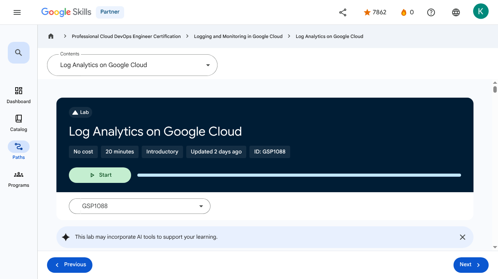
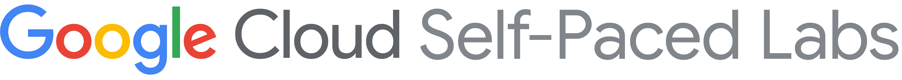
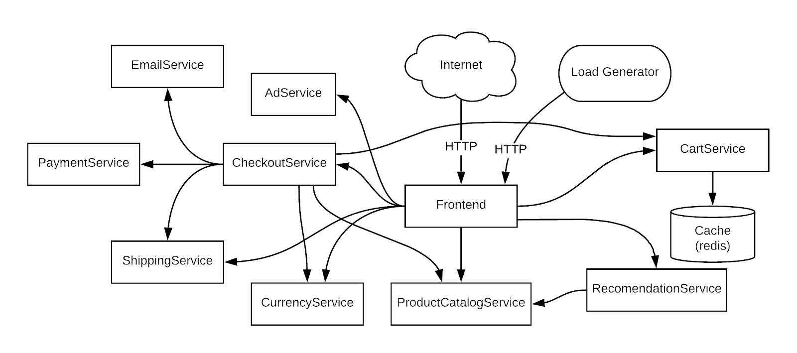
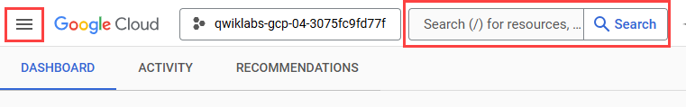
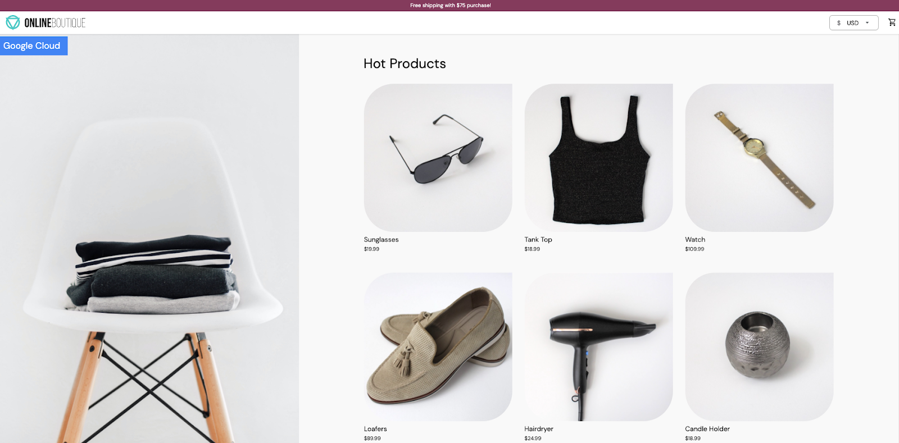
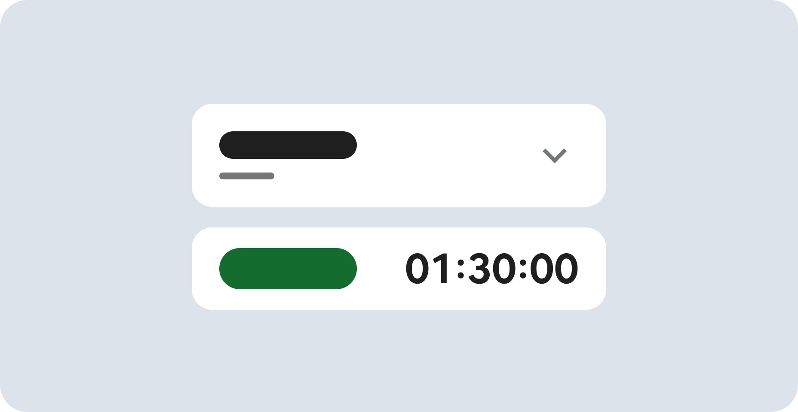
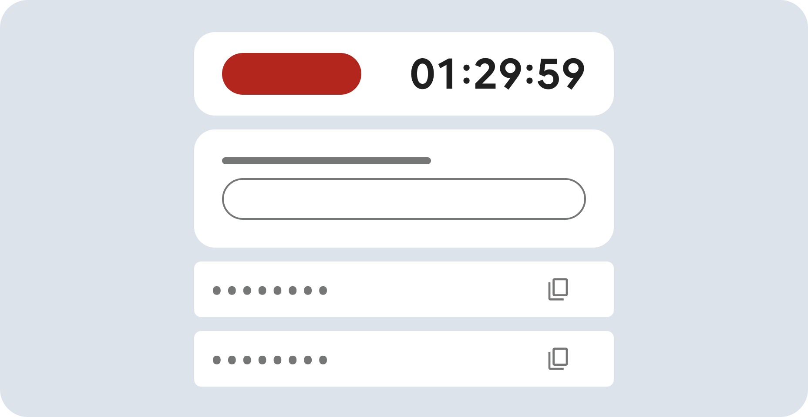
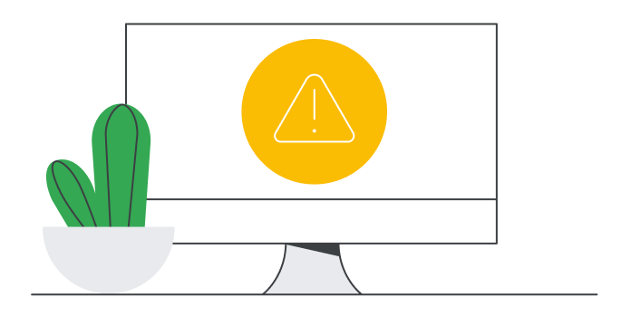
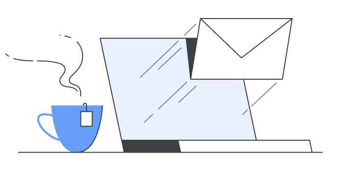
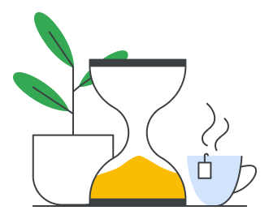

# Advanced Logging and Analysis - Log Analytics on Google Cloud | Google Skills for Partners

> Offline lesson archive generated by Google Skills scraper.

---

## Metadata

- **Original URL:** https://partner.skills.google/paths/20/course_sessions/40490346/labs/621234
- **Lesson type:** `labs`
- **Path ID:** `20`
- **Container type:** `course_sessions`
- **Container ID:** `40490346`
- **Lesson ID:** `621234`
- **Generated:** 2026-07-13 04:06:55

---

## Full Page Screenshot



---

## Video

_No video found for this page._

---

## Transcript

_No transcript available._

---

## Lesson Text

Partner
0
navigate_next
Professional Cloud DevOps Engineer Certification
navigate_next
Logging and Monitoring in Google Cloud
navigate_next
Log Analytics on Google Cloud
This lab may incorporate AI tools to support your learning.
GSP1088
Overview

Cloud Logging is a fully managed service that allows you to store, search, analyze, monitor, and alert on logging data and events from Google Cloud. In this lab you learn about the features and tools provided by Cloud Logging to gain insight into your applications.

What you'll learn

In this lab you learn how to:

Use Cloud Logging effectively and get insight about applications running on Google Kubernetes Engine (GKE).
Effectively build and run queries using log analytics.
The demo application used in the lab

In this lab, you work through a scenario based on this microservices demo app deployed to a GKE cluster. This demo app has many microservices and dependencies embedded in it.

Setup and requirements
Before you click the Start Lab button

Read these instructions. Labs are timed and you cannot pause them. The timer, which starts when you click Start Lab, shows how long Google Cloud resources are made available to you.

This hands-on lab lets you do the lab activities in a real cloud environment, not in a simulation or demo environment. It does so by giving you new, temporary credentials you use to sign in and access Google Cloud for the duration of the lab.

To complete this lab, you need:

Access to a standard internet browser (Chrome browser recommended).
Note: Use an Incognito (recommended) or private browser window to run this lab. This prevents conflicts between your personal account and the student account, which may cause extra charges incurred to your personal account.
Time to complete the lab—remember, once you start, you cannot pause a lab.
Note: Use only the student account for this lab. If you use a different Google Cloud account, you may incur charges to that account.
How to start your lab and sign in to the Google Cloud console

Click the Start Lab button. If you need to pay for the lab, a dialog opens for you to select your payment method. On the right is the Lab setup and access panel with the following:

The Open Google Cloud console button
The temporary credentials (username and password) that you must use for this lab
Other information, if needed, to step through this lab

Note that the lab timer is located near the top of the page, showing the remaining time.

Click Open Google Cloud console (or right-click and select Open Link in Incognito Window if you are running the Chrome browser).

The lab spins up resources, and then opens another tab that shows the Sign in page.

Tip: Arrange the tabs in separate windows, side-by-side.

Note: If you see the Choose an account dialog, click Use Another Account.

If necessary, copy the Username below and paste it into the Sign in dialog.

You can also find the Username in the Lab setup and access panel.

Click Next.

Copy the Password below and paste it into the Welcome dialog.

You can also find the Password in the Lab setup and access panel.

Click Next.

Important: You must use the credentials the lab provides you. Do not use your Google Cloud account credentials.
Note: Using your own Google Cloud account for this lab may incur extra charges.

Click through the subsequent pages:

Accept the terms and conditions.
Do not add recovery options or two-factor authentication (because this is a temporary account).
Do not sign up for free trials.

After a few moments, the Google Cloud console opens in this tab.

Note: To access Google Cloud products and services, click the Navigation menu or type the service or product name in the Search field. 
Activate Cloud Shell

Cloud Shell is a virtual machine that is loaded with development tools. It offers a persistent 5GB home directory and runs on the Google Cloud. Cloud Shell provides command-line access to your Google Cloud resources.

Click Activate Cloud Shell  at the top of the Google Cloud console.

Click through the following windows:

Continue through the Cloud Shell information window.
Authorize Cloud Shell to use your credentials to make Google Cloud API calls.

When you are connected, you are already authenticated, and the project is set to your Project_ID, . The output contains a line that declares the Project_ID for this session:

gcloud is the command-line tool for Google Cloud. It comes pre-installed on Cloud Shell and supports tab-completion.

(Optional) You can list the active account name with this command:
Click Authorize.

Output:

(Optional) You can list the project ID with this command:

Output:

Note: For full documentation of gcloud, in Google Cloud, refer to the gcloud CLI overview guide.
Task 1. Infrastructure setup
Verify the GKE cluster

Connect to a GKE cluster and validate that it's been created correctly.

In Cloud Shell, set the zone in gcloud:
Use the following command to see the cluster's status:

You should see a similar status:

The cluster status should say RUNNING. If it's still PROVISIONING, wait a moment and run the command above again. Repeat until the status is RUNNING.

You can also check the progress in the Google Cloud console. In the Navigation menu () click Kubernetes Engine > Clusters.

Once your cluster has RUNNING status, get the cluster credentials:

Your output should look like this:

Verify that the nodes have been created:

Your output should look like this:

Task 2. Deploy the application

Next, you deploy a microservices application called Online Boutique to your cluster to create an actual workload you can monitor.

Run the following to clone the repo:
Navigate to the microservices-demo directory:
Install the app using kubectl:
Confirm that everything is running correctly:

The output should look similar to the output below. Re-run the command until all pods are reporting a Running status before moving to the next step.

Run the following commands to get the external IP of the application.

An IP address is returned only after the service has been deployed. You may need to repeat the commands until there's an external IP address assigned.

When the IP address is assigned, your output should be similar to this:

Finally, confirm that the app is up and running:

Your confirmation looks like this:

After the application is deployed, you can also view the status in the console.

On the Kubernetes Engine page, in the left pane, click Workloads to see that all the pods are OK.

In the left pane, click Gateways, Services & Ingress, then click the Services tab and check that all services show an OK status.

Open the application

On Gateways, Services & Ingress > Services , click the Endpoint IP of the service frontend-external.

It should open a demo web page similar to the following:

Note: You may need to click a "Continue to site" button if prompted.

Click Check my progress to verify the objective.Deploy application

Task 3. Manage log buckets

There are two ways to enable Log Analytics. One way is to upgrade an existing bucket. The other is to create a new log bucket with Log Analytics enabled.

Upgrade an existing bucket

You can use the following steps to upgrade an existing log bucket.

In the console, in the Navigation menu (), click View all products > Observability > Logging. Click Favorite for easier access later in the lab.

Click Logs storage.

Click Upgrade for an existing bucket, Default bucket.

Click Upgrade in the confirmation dialog.

Wait for the status to change to Upgraded.

Click Open and select the view _AllLogs.

The Log Analytics page opens.

Create a new Log bucket

You can use the following steps to create a new log bucket.

In the left pane, click Logs storage and then click Create log bucket at the top of the Logs Storage window.

Provide a name, such as day2ops-log to the bucket.

Check both Upgrade to use Log Analytics and Create a new BigQuery dataset that links to this bucket.

Type in a BigQuery dataset name day2ops_log.

For the Region field, select the Global option.

Selecting Create a linked dataset in BigQuery creates a dataset for you in BigQuery if it does not exist. This lets you run queries in BigQuery.

Click Create bucket to create the log bucket.

Click Check my progress to verify the objective.Create a Log bucket

Write to the new Log bucket

There are a couple ways to create a log sink to route log entries to the new log bucket:

From the Logs router directly.
From Logs explorer. You can run log queries to select and filter the logs you are interested in when you create a sink. The advantage to this approach is the log query is automatically copied to the sink configuration as the filter.

Click Logs explorer in the left pane.

In the top-right, enable Show query and run the following query in the query field:

Click Actions > Create sink.

For sink name type day2ops-sink.

Click Next.

Select Logging bucket in the sink service dropdown list.

Select the new log bucket you just created.

Your new log bucket should be similar to this:

Click Next.

You should see the resource type query already in the filter.

Click Create sink.

Wait about a minute and your sink should be created.

Click Check my progress to verify the objective.Create the log sink

Read from the new Log bucket

In the left pane, navigate to Logs explorer. Notice in the Fields list, in the Resource Type section, that there are many different resource types for the logs.

To view the logs in the new log bucket, at the top left of the Logs explorer window, click Project logs > Log view > the new log bucket (that you just created).

Click Apply.

You see that Kubernetes Containers is now the only resource type and there are fewer log entries. That's because only filtered logs are sent to the bucket.

Task 4. Log analysis
On the left pane, click Log Analytics to open the Log Analytics page.

If your query field is empty or you forget which table to use, click the Run query button to get the sample query back.

You can run your own queries in the query field. This task provides some examples.

Important: The log view name in the FROM clause is different for the log buckets. Be sure you use the correct view name. You can use the previous step to verify.
Example query to find the min, max, and average latency

From the right pane, select <> SQL. Click the Clear button to remove any existing content from the query editor. Paste the query into the editor, then select Run query to retrieve the most recent errors from the containers.

Use the query to find the min, max, and average latencies in a timeframe for the frontend service:

Example query to find the number of Product page visits

Use the query to find how many times users visit a certain product page in the past hour:

Example query to find how many sessions end with a shopping cart checkout

Use the query to find how many sessions end up with checkout (POST call to the /cart/checkout service):

Congratulations!

You now have experience using Cloud Logging to get insight about applications running on GKE, and you built and ran queries using log analytics.

Google Cloud training and certification

...helps you make the most of Google Cloud technologies. Our classes include technical skills and best practices to help you get up to speed quickly and continue your learning journey. We offer fundamental to advanced level training, with on-demand, live, and virtual options to suit your busy schedule. Certifications help you validate and prove your skill and expertise in Google Cloud technologies.

Manual Last Updated June 19, 2026

Lab Last Tested June 19, 2026

Copyright 2026 Google LLC. All rights reserved. Google and the Google logo are trademarks of Google LLC. All other company and product names may be trademarks of the respective companies with which they are associated.

Previous
Next
Recertify in 3 simple steps:
Link your Google Skills and certification account profiles using the same email to get started.
Instantly see which certifications are eligible for renewal.
Complete courses and skill badges to renew your certifications automatically.

By clicking "Accept", I consent to share my name, email, and course completion data with Google Skills' certification partner, CM Connect, to receive continuing education credit for certification renewal.

Before you begin
Labs create a Google Cloud project and resources for a fixed time
Labs have a time limit and no pause feature. If you end the lab, you'll have to restart from the beginning.
On the top left of your screen, click Start lab to begin

This content is not currently available

We will notify you via email when it becomes available

Great!

We will contact you via email if it becomes available

One lab at a time

Confirm to end all existing labs and start this one

Use private browsing to run the lab
Using an Incognito or private browser window is the best way to run this lab. This prevents any conflicts between your personal account and the Student account, which may cause extra charges incurred to your personal account.
Additional Comments

Complete this quick step to start your lab.

---

## Images

### Image 1


### Image 2


### Image 3



### Image 4



### Image 5



### Image 6



### Image 7



### Image 8



### Image 9


### Image 10



### Image 11



### Image 12



### Image 13


### Image 14


### Image 15


### Image 16


---

## Main Resources

### youtube

- [Youtube](https://www.youtube.com/@googlecloud)

### labs

- [Resource](https://support.google.com/qwiklabs/contact/Google_Skills_Partner)
- [Monitoring and Dashboarding Multiple Projects](https://partner.skills.google/paths/20/course_sessions/40490346/labs/621215)
- [Alerting in Google Cloud](https://partner.skills.google/paths/20/course_sessions/40490346/labs/621222)
- [Service Monitoring](https://partner.skills.google/paths/20/course_sessions/40490346/labs/621224)
- [Log Analytics on Google Cloud](https://partner.skills.google/paths/20/course_sessions/40490346/labs/621234)
- [Cloud Audit Logs](https://partner.skills.google/paths/20/course_sessions/40490346/labs/621242)

### external_links

- [Resource](https://partner.skills.google/)
- [Professional Cloud DevOps Engineer Certification](https://partner.skills.google/paths/20)
- [Logging and Monitoring in Google Cloud](https://partner.skills.google/paths/20/course_templates/99)
- [microservices demo](https://github.com/GoogleCloudPlatform/microservices-demo)
- [the gcloud CLI overview guide](https://cloud.google.com/sdk/gcloud)
- [Our classes](https://cloud.google.com/training)
- [Certifications](https://cloud.google.com/certification/)
- [Dashboard](https://partner.skills.google/)
- [Catalog](https://partner.skills.google/catalog)
- [Paths](https://partner.skills.google/paths)
- [Subscriptions](https://partner.skills.google/subscriptions)
- [Activities](https://partner.skills.google/profile/stay_on_track)
- [Achievements](https://partner.skills.google/profile/badges)
- [https://partner.skills.google/catalog_lab/5346](https://partner.skills.google/catalog_lab/5346)
- [Resource](https://x.com/intent/tweet?text=Learn%20cloud%20tech%20through%20hands-on%20training%20on%20%23GoogleSkills%21&url=https%3A%2F%2Fpartner.skills.google%2Fcatalog_lab%2F5346%3Futm_medium%3Dsocial%26utm_source%3Dx%26utm_campaign%3Dql-social-share&hashtags=)
- [Resource](https://partner.skills.google/profile/activity)
- [Resource](https://partner.skills.google/my_account/profile)
- [Programs](https://partner.skills.google/my_account/programs)
- [Overview](https://partner.skills.google/paths/20/course_templates/99)
- [Introduction to Google Cloud Observability](https://partner.skills.google/paths/20/course_sessions/40490346/html_bundles/621199)
- [Monitoring](https://partner.skills.google/paths/20/course_sessions/40490346/html_bundles/621200)
- [Need for Google Cloud observability](https://partner.skills.google/paths/20/course_sessions/40490346/html_bundles/621201)
- [Google Cloud Observability](https://partner.skills.google/paths/20/course_sessions/40490346/html_bundles/621202)
- [Cloud Monitoring](https://partner.skills.google/paths/20/course_sessions/40490346/html_bundles/621203)
- [Cloud Logging](https://partner.skills.google/paths/20/course_sessions/40490346/html_bundles/621204)
- [Error Reporting](https://partner.skills.google/paths/20/course_sessions/40490346/html_bundles/621205)
- [Application Performance Management Tools](https://partner.skills.google/paths/20/course_sessions/40490346/html_bundles/621206)
- [Module Summary](https://partner.skills.google/paths/20/course_sessions/40490346/html_bundles/621207)
- [Quiz - Introduction to Google Cloud Observability](https://partner.skills.google/paths/20/course_sessions/40490346/quizzes/621208)
- [Monitoring Overview](https://partner.skills.google/paths/20/course_sessions/40490346/html_bundles/621209)
- [Cloud Monitoring achitecture patterns](https://partner.skills.google/paths/20/course_sessions/40490346/html_bundles/621210)
- [Monitoring multiple projects](https://partner.skills.google/paths/20/course_sessions/40490346/html_bundles/621211)
- [Data model and dashboards](https://partner.skills.google/paths/20/course_sessions/40490346/html_bundles/621212)
- [Query metrics](https://partner.skills.google/paths/20/course_sessions/40490346/html_bundles/621213)
- [Uptime checks](https://partner.skills.google/paths/20/course_sessions/40490346/html_bundles/621214)
- [Module summary](https://partner.skills.google/paths/20/course_sessions/40490346/html_bundles/621216)
- [Quiz - Monitoring critical systems](https://partner.skills.google/paths/20/course_sessions/40490346/quizzes/621217)
- [Module Overview](https://partner.skills.google/paths/20/course_sessions/40490346/html_bundles/621218)
- [SLI, SLO, and SLA](https://partner.skills.google/paths/20/course_sessions/40490346/html_bundles/621219)
- [Developing an alerting strategy](https://partner.skills.google/paths/20/course_sessions/40490346/html_bundles/621220)
- [Creating alerts](https://partner.skills.google/paths/20/course_sessions/40490346/html_bundles/621221)
- [Service Monitoring](https://partner.skills.google/paths/20/course_sessions/40490346/html_bundles/621223)
- [Module summary](https://partner.skills.google/paths/20/course_sessions/40490346/html_bundles/621225)
- [Quiz - Alerting Policies](https://partner.skills.google/paths/20/course_sessions/40490346/quizzes/621226)
- [Module Overview](https://partner.skills.google/paths/20/course_sessions/40490346/html_bundles/621227)
- [Cloud Logging overview and architecture](https://partner.skills.google/paths/20/course_sessions/40490346/html_bundles/621228)
- [Log types and collection](https://partner.skills.google/paths/20/course_sessions/40490346/html_bundles/621229)
- [Storing, routing and exporting the logs](https://partner.skills.google/paths/20/course_sessions/40490346/html_bundles/621230)
- [Query and view logs](https://partner.skills.google/paths/20/course_sessions/40490346/html_bundles/621231)
- [Using log-based metrics](https://partner.skills.google/paths/20/course_sessions/40490346/html_bundles/621232)
- [Log analytics](https://partner.skills.google/paths/20/course_sessions/40490346/html_bundles/621233)
- [Module Summary](https://partner.skills.google/paths/20/course_sessions/40490346/html_bundles/621235)
- [Quiz - Advanced Logging and Analysis](https://partner.skills.google/paths/20/course_sessions/40490346/quizzes/621236)
- [Module Overview](https://partner.skills.google/paths/20/course_sessions/40490346/html_bundles/621237)
- [Cloud Audit Logs](https://partner.skills.google/paths/20/course_sessions/40490346/html_bundles/621238)
- [Data Access audit logs](https://partner.skills.google/paths/20/course_sessions/40490346/html_bundles/621239)
- [Audit logs entry format](https://partner.skills.google/paths/20/course_sessions/40490346/html_bundles/621240)
- [Best practices](https://partner.skills.google/paths/20/course_sessions/40490346/html_bundles/621241)
- [Module Summary](https://partner.skills.google/paths/20/course_sessions/40490346/html_bundles/621243)
- [Quiz - Working with Audit Logs](https://partner.skills.google/paths/20/course_sessions/40490346/quizzes/621244)
- [Course 1 Summary](https://partner.skills.google/paths/20/course_sessions/40490346/html_bundles/621245)
- [Course Resources](https://partner.skills.google/paths/20/course_sessions/40490346/documents/621246)
- [Claim credential](https://partner.skills.google/paths/20/course_templates/99/badge)
- [Course Survey
      Recommended](https://partner.skills.google/paths/20/course_templates/99/course_surveys/0)
- [Resource](https://partner.skills.google/paths/20/course_sessions/40490346/html_bundles/621233)
- [Resource](https://partner.skills.google/paths/20/course_sessions/40490346/html_bundles/621235)
- [Resource](https://partner.skills.google/focuses/827494157/set_up_lab_forward_url?course_template=99&parent=course_session)
- [Resource](https://partner.skills.google/paths/20/course_templates/99/preview)

---

## Headings

- **H4**: Checkpoints
- **H1**: Log Analytics on Google Cloud
- **H2**: GSP1088
- **H2**: Overview
- **H3**: What you'll learn
- **H2**: The demo application used in the lab
- **H2**: Setup and requirements
- **H3**: Before you click the Start Lab button
- **H3**: How to start your lab and sign in to the Google Cloud console
- **H3**: Activate Cloud Shell
- **H2**: Task 1. Infrastructure setup
- **H3**: Verify the GKE cluster
- **H2**: Task 2. Deploy the application
- **H3**: Open the application
- **H2**: Task 3. Manage log buckets
- **H3**: Upgrade an existing bucket
- **H3**: Create a new Log bucket
- **H3**: Write to the new Log bucket
- **H3**: Read from the new Log bucket
- **H2**: Task 4. Log analysis
- **H3**: Example query to find the min, max, and average latency
- **H3**: Example query to find the number of Product page visits
- **H3**: Example query to find how many sessions end with a shopping cart checkout
- **H2**: Congratulations!
- **H3**: Google Cloud training and certification
- **H2**: Recertify in 3 simple steps:
- **H1**: Before you begin
- **H1**: Use private browsing
- **H1**: Sign in to the Console
- **H1**: Score Details
- **H1**: Use private browsing to run the lab
- **H1**: How satisfied are you with this lab?*
- **H1**: Are you sure? You may not be able to restart the lab, and you'll need to start from the beginning if you do.
- **H1**: Verify you're human
- **H1**: A newer version of this course is available. Your progress will carry over if you choose to upgrade. However, your completion percentage may change if the new version has added or removed any learning activities. Click the preview button to see the course changes before upgrading.

---

## Code Blocks / Commands

### Code Block 1

```
"Username"
```


### Code Block 2

```
"Password"
```


### Code Block 3

```
PROJECT_ID
```


### Code Block 4

```
Your Cloud Platform project in this session is set to "PROJECT_ID"
```


### Code Block 5

```
gcloud
```


### Code Block 6

```
gcloud auth list
```


### Code Block 7

```
ACTIVE: *
ACCOUNT: "ACCOUNT"

To set the active account, run:
    $ gcloud config set account `ACCOUNT`
```


### Code Block 8

```
gcloud config list project
```


### Code Block 9

```
[core]
project = "PROJECT_ID"
```


### Code Block 10

```
gcloud config set compute/zone placeholder
```


### Code Block 11

```
gcloud container clusters list
```


### Code Block 12

```
NAME: day2-ops
LOCATION: us-west1
MASTER_VERSION: 1.31.5-gke.1023000
MASTER_IP: 34.169.197.173
MACHINE_TYPE: e2-standard-2
NODE_VERSION: 1.31.5-gke.1023000
NUM_NODES: 3
STATUS: RUNNING
```


### Code Block 13

```
gcloud container clusters get-credentials day2-ops --region placeholder
```


### Code Block 14

```
Fetching cluster endpoint and auth data.
kubeconfig entry generated for day2-ops.
```


### Code Block 15

```
kubectl get nodes
```


### Code Block 16

```
NAME                                            STATUS   ROLES    AGE   VERSION
gke-day2-ops-day2-ops-node-pool-0d9c7ef3-xc44   Ready    <none>   11m   v1.31.5-gke.1023000
gke-day2-ops-day2-ops-node-pool-b17ac6d6-tch7   Ready    <none>   11m   v1.31.5-gke.1023000
gke-day2-ops-day2-ops-node-pool-ed506ae8-wsc5   Ready    <none>   11m   v1.31.5-gke.1023000
```


### Code Block 17

```
git clone https://github.com/GoogleCloudPlatform/microservices-demo.git
```


### Code Block 18

```
microservices-demo
```


### Code Block 19

```
cd microservices-demo
```


### Code Block 20

```
kubectl
```


### Code Block 21

```
kubectl apply -f release/kubernetes-manifests.yaml
```


### Code Block 22

```
kubectl get pods
```


### Code Block 23

```
NAME                                     READY     STATUS    RESTARTS   AGE
adservice-55f94cfd9c-4lvml               1/1       Running   0          20m
cartservice-6f4946f9b8-6wtff             1/1       Running   2          20m
checkoutservice-5688779d8c-l6crl         1/1       Running   0          20m
currencyservice-665d6f4569-b4sbm         1/1       Running   0          20m
emailservice-684c89bcb8-h48sq            1/1       Running   0          20m
frontend-67c8475b7d-vktsn                1/1       Running   0          20m
loadgenerator-6d646566db-p422w           1/1       Running   0          20m
paymentservice-858d89d64c-hmpkg          1/1       Running   0          20m
productcatalogservice-bcd85cb5-d6xp4     1/1       Running   0          20m
recommendationservice-685d7d6cd9-pxd9g   1/1       Running   0          20m
redis-cart-9b864d47f-c9xc6               1/1       Running   0          20m
shippingservice-5948f9fb5c-vndcp         1/1       Running   0          20m
```


### Code Block 24

```
export EXTERNAL_IP=$(kubectl get service frontend-external -o jsonpath="{.status.loadBalancer.ingress[0].ip}")
echo $EXTERNAL_IP
```


### Code Block 25

```
35.222.235.86
```


### Code Block 26

```
curl -o /dev/null -s -w "%{http_code}\n"  http://${EXTERNAL_IP}
```


### Code Block 27

```
200
```


### Code Block 28

```
Default bucket
```


### Code Block 29

```
_AllLogs
```


### Code Block 30

```
resource.type="k8s_container"
```


### Code Block 31

```
projects/qwiklabs-gcp-00-xxxxxxx/locations/global/buckets/day2ops-log
```


### Code Block 32

```
FROM
```


### Code Block 33

```
SELECT
hour,
MIN(took_ms) AS min,
MAX(took_ms) AS max,
AVG(took_ms) AS avg
FROM (
SELECT
  FORMAT_TIMESTAMP("%H", timestamp) AS hour,
  CAST( JSON_VALUE(json_payload,
      '$."http.resp.took_ms"') AS INT64 ) AS took_ms
FROM
  `"PROJECT_ID".global.day2ops-log._AllLogs`
WHERE
  timestamp > TIMESTAMP_SUB(CURRENT_TIMESTAMP(), INTERVAL 24 HOUR)
  AND json_payload IS NOT NULL
  AND SEARCH(labels,
    "frontend")
  AND JSON_VALUE(json_payload.message) = "request complete"
ORDER BY
  took_ms DESC,
  timestamp ASC )
GROUP BY
1
ORDER BY
1
```


### Code Block 34

```
SELECT
count(*)
FROM
`"PROJECT_ID".global.day2ops-log._AllLogs`
WHERE
text_payload like "GET %/product/L9ECAV7KIM %"
AND
timestamp > TIMESTAMP_SUB(CURRENT_TIMESTAMP(), INTERVAL 1 HOUR)
```


### Code Block 35

```
SELECT
 JSON_VALUE(json_payload.session),
 COUNT(*)
FROM
 `"PROJECT_ID".global.day2ops-log._AllLogs`
WHERE
 JSON_VALUE(json_payload['http.req.method']) = "POST"
 AND JSON_VALUE(json_payload['http.req.path']) = "/cart/checkout"
 AND timestamp > TIMESTAMP_SUB(CURRENT_TIMESTAMP(), INTERVAL 1 HOUR)
GROUP BY
 JSON_VALUE(json_payload.session)
```


---

## Related Files

- [README.md](README.md)
- [lesson.md](lesson.md)
- [readable_page.html](readable_page.html)
- [page.html](page.html)
- [page_text.txt](page_text.txt)
- [transcript.txt](transcript.txt)
- [screenshot.png](screenshot.png)
- [assets/](assets/)
- [assets/](assets/)
