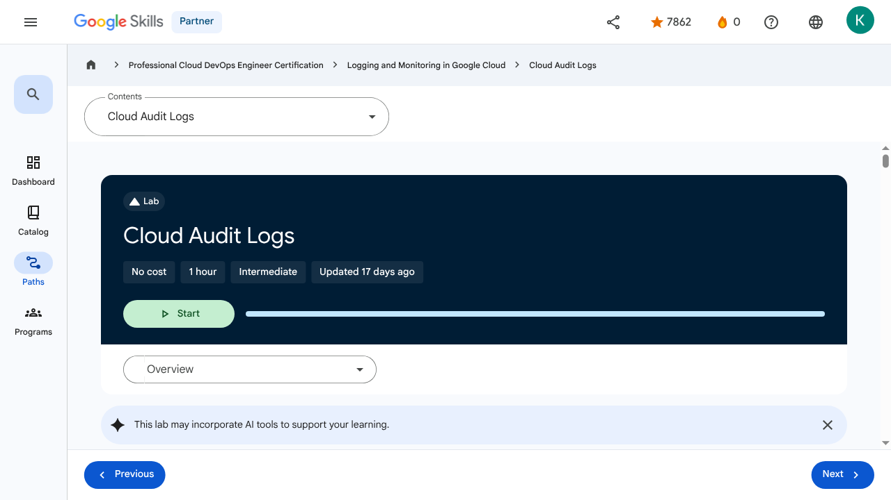
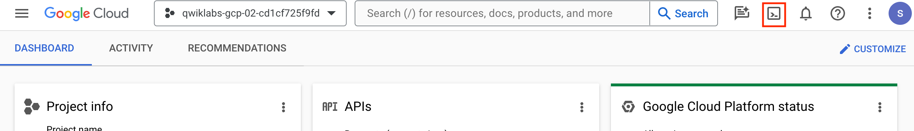
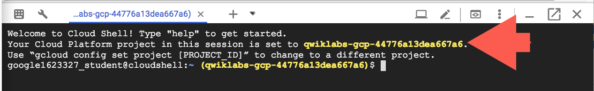
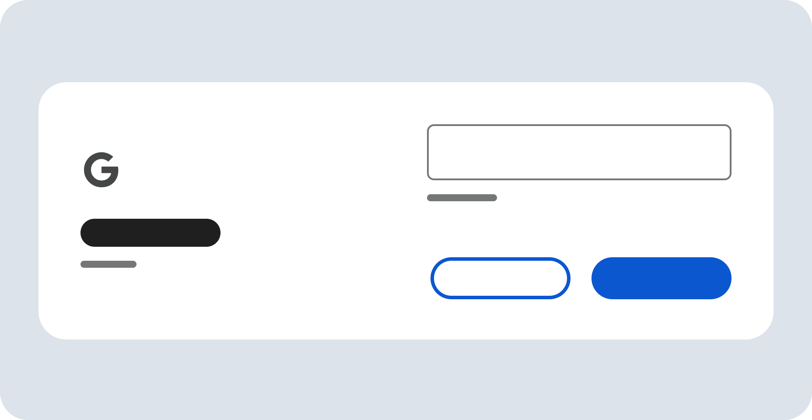
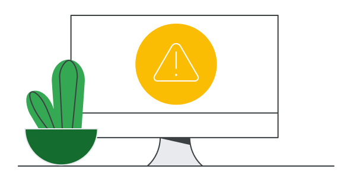

# Working with Audit Logs - Cloud Audit Logs | Google Skills for Partners

> Offline lesson archive generated by Google Skills scraper.

---

## Metadata

- **Original URL:** https://partner.skills.google/paths/20/course_sessions/40490346/labs/621242
- **Lesson type:** `labs`
- **Path ID:** `20`
- **Container type:** `course_sessions`
- **Container ID:** `40490346`
- **Lesson ID:** `621242`
- **Generated:** 2026-07-13 04:07:25

---

## Full Page Screenshot



---

## Video

_No video found for this page._

---

## Transcript

_No transcript available._

---

## Lesson Text

Partner
0
navigate_next
Professional Cloud DevOps Engineer Certification
navigate_next
Logging and Monitoring in Google Cloud
navigate_next
Cloud Audit Logs
This lab may incorporate AI tools to support your learning.
Overview

In this lab, you investigate Google Cloud Audit Logs. Cloud Audit Logging maintains multiple audit logs for each project, folder, and organization, all of which help answer the question, "Who did what, when, and where?"

Objectives

In this lab, you learn how to:

Enable data access logs on Cloud Storage.
Generate admin and data access activity.
View Audit logs.
Setup and requirements

For each lab, you get a new Google Cloud project and set of resources for a fixed time at no cost.

Click the Start Lab button. If you need to pay for the lab, a pop-up opens for you to select your payment method. On the right is the Lab setup and access panel with the following:

The Open Google Cloud console button
The temporary credentials (username and password) that you must use for this lab
Other information, if needed, to step through this lab

Note that the lab timer is located near the top of the page, showing the remaining time.

Click Open Google Cloud console (or right-click and select Open Link in Incognito Window if you are running the Chrome browser).

The lab spins up resources, and then opens another tab that shows the Sign in page.

Tip: Arrange the tabs in separate windows, side-by-side.

Note: If you see the Choose an account dialog, click Use Another Account.

If necessary, copy the Username below and paste it into the Sign in dialog.

You can also find the Username in the Lab setup and access panel.

Click Next.

Copy the Password below and paste it into the Welcome dialog.

You can also find the Password in the Lab setup and access panel.

Click Next.

Important: You must use the credentials the lab provides you. Do not use your Google Cloud account credentials.
Note: Using your own Google Cloud account for this lab may incur extra charges.

Click through the subsequent pages:

Accept the terms and conditions.
Do not add recovery options or two-factor authentication (because this is a temporary account).
Do not sign up for free trials.

After a few moments, the Google Cloud console opens in this tab.

Note: To view a menu with a list of Google Cloud products and services, click the Navigation menu at the top-left, or type the service or product name in the Search field. 

After you complete the initial sign-in steps, the project dashboard appears.

Activate Google Cloud Shell

Google Cloud Shell is a virtual machine that is loaded with development tools. It offers a persistent 5GB home directory and runs on the Google Cloud.

Google Cloud Shell provides command-line access to your Google Cloud resources.

In Cloud console, on the top right toolbar, click the Open Cloud Shell button.

Click Continue.

It takes a few moments to provision and connect to the environment. When you are connected, you are already authenticated, and the project is set to your PROJECT_ID. For example:

gcloud is the command-line tool for Google Cloud. It comes pre-installed on Cloud Shell and supports tab-completion.

You can list the active account name with this command:

Output:

Example output:

You can list the project ID with this command:

Output:

Example output:

Note: Full documentation of gcloud is available in the gcloud CLI overview guide .
Task 1. Enable data access logs on Cloud Storage

In this task, you enable data access logs on Cloud Storage to track operations that read or write user-provided data, as well as metadata and configuration information.

In the Google Cloud console, in the Navigation menu () click IAM & Admin > Audit Logs.

Scroll or use Filter to locate Google Cloud Storage, then check the box next to it. This should display the Info Panel with options on LOG TYPES.

Data Access audit logs are divided into different categories:

Admin Read: Records operations that read metadata or configuration information. Admin Activity audit logs record writes of metadata and configuration information. They can't be disabled.
Data Read: Records operations that read user-provided data.
Data Write: Records operations that write user-provided data.
Select Admin Read, Data Read and Data Write, and then click Save.

Click Check my progress to verify the objective.Enable data access logs on Cloud Storage

Task 2. Generate some admin and data access activity

In this task, you generate admin and data access activity by creating a storage bucket. You then upload a file, create a network and VM, and then delete the storage bucket.

Open or switch to your Cloud Shell terminal.

Use gcloud storage to create a Cloud Storage bucket with the same name as your project. If prompted, click Authorize:

Make sure the bucket successfully created:
Create a simple "Hello World" type of text file and upload it to your bucket:
Verify the file is in the bucket:
Create a new auto mode network named mynetwork, then create a new virtual machine and place it on the new network:

Click Check my progress to verify the objective.Check the creation of bucket, network and virtual machine instance

Delete the storage bucket:
Task 3. Viewing audit logs

In this task, you view and explore both Admin Activity and Data Access audit logs in the Logs Explorer, examining the details of logged events such as bucket deletion and data access operations. You then read the Data Access logs using the Cloud SDK.

Admin Activity logs contain log entries for API calls or other administrative actions that modify the configuration or metadata of resources. For example, the logs record when VM instances and App Engine applications are created, or when permissions are changed. To view the logs, you must have the Cloud Identity and Access Management roles Logging/Logs Viewer or Project/Viewer.

Admin Activity logs are always enabled so there is no need to enable them. There is no charge for your Admin Activity audit logs.

In the Google Cloud console, in the Navigation menu () click View all products > Observability > Logging.

In Logs Explorer, enable Show query and delete the contents of Query box.

Click the All log names dropdown and use the filter to locate the activity log under Cloud Audit section and Apply it to the query.

Press the Run query button, and then use the Log fields explorer to filter to GCS Bucket entries.

Locate the log entry for when the Cloud Storage was deleted.

Expand the delete entry, then drill into protoPayload > authenticationInfo field and notice you can see the email address of the user that performed this action.

Feel free to explore other fields in the entry. Also, notice how many of the values can be clicked to add inclusions/exclusions to the query.

Delete the existing query and use All log names to view the data_access logs.

What operations can you see now?

Click Check my progress to verify the objective.Viewing audit logs

Using the Cloud SDK

Log entries can also be read using the Cloud SDK command:

Example:

Switch to or reopen a Cloud Shell terminal.

If we wanted to see those same data access logs using the command line, we could run the following:

Congratulations!

In this exercise, you examined and worked with Google Cloud's Audit Logs. Now you can do a better job figuring out exactly who did what, when. Nice job.

End your lab

When you have completed your lab, click End Lab. Google Skills removes the resources you’ve used and cleans the account for you.

You will be given an opportunity to rate the lab experience. Select the applicable number of stars, type a comment, and then click Submit.

The number of stars indicates the following:

1 star = Very dissatisfied
2 stars = Dissatisfied
3 stars = Neutral
4 stars = Satisfied
5 stars = Very satisfied

You can close the dialog box if you don't want to provide feedback.

For feedback, suggestions, or corrections, please use the Support tab.

Copyright 2026 Google LLC All rights reserved. Google and the Google logo are trademarks of Google LLC. All other company and product names may be trademarks of the respective companies with which they are associated.

Previous
Next
Recertify in 3 simple steps:
Link your Google Skills and certification account profiles using the same email to get started.
Instantly see which certifications are eligible for renewal.
Complete courses and skill badges to renew your certifications automatically.

By clicking "Accept", I consent to share my name, email, and course completion data with Google Skills' certification partner, CM Connect, to receive continuing education credit for certification renewal.

Before you begin
Labs create a Google Cloud project and resources for a fixed time
Labs have a time limit and no pause feature. If you end the lab, you'll have to restart from the beginning.
On the top left of your screen, click Start lab to begin

This content is not currently available

We will notify you via email when it becomes available

Great!

We will contact you via email if it becomes available

One lab at a time

Confirm to end all existing labs and start this one

Use private browsing to run the lab
Using an Incognito or private browser window is the best way to run this lab. This prevents any conflicts between your personal account and the Student account, which may cause extra charges incurred to your personal account.
Additional Comments

Complete this quick step to start your lab.

---

## Images

### Image 1


### Image 2


### Image 3


### Image 4


### Image 5



### Image 6



### Image 7


### Image 8


### Image 9



### Image 10


### Image 11


### Image 12


### Image 13



### Image 14


### Image 15


### Image 16


---

## Main Resources

### youtube

- [Youtube](https://www.youtube.com/@googlecloud)

### labs

- [Resource](https://support.google.com/qwiklabs/contact/Google_Skills_Partner)
- [Monitoring and Dashboarding Multiple Projects](https://partner.skills.google/paths/20/course_sessions/40490346/labs/621215)
- [Alerting in Google Cloud](https://partner.skills.google/paths/20/course_sessions/40490346/labs/621222)
- [Service Monitoring](https://partner.skills.google/paths/20/course_sessions/40490346/labs/621224)
- [Log Analytics on Google Cloud](https://partner.skills.google/paths/20/course_sessions/40490346/labs/621234)
- [Cloud Audit Logs](https://partner.skills.google/paths/20/course_sessions/40490346/labs/621242)

### external_links

- [Resource](https://partner.skills.google/)
- [Professional Cloud DevOps Engineer Certification](https://partner.skills.google/paths/20)
- [Logging and Monitoring in Google Cloud](https://partner.skills.google/paths/20/course_templates/99)
- [gcloud CLI overview guide](https://cloud.google.com/sdk/gcloud)
- [Dashboard](https://partner.skills.google/)
- [Catalog](https://partner.skills.google/catalog)
- [Paths](https://partner.skills.google/paths)
- [Subscriptions](https://partner.skills.google/subscriptions)
- [Activities](https://partner.skills.google/profile/stay_on_track)
- [Achievements](https://partner.skills.google/profile/badges)
- [https://partner.skills.google/catalog_lab/3422](https://partner.skills.google/catalog_lab/3422)
- [Resource](https://x.com/intent/tweet?text=Learn%20cloud%20tech%20through%20hands-on%20training%20on%20%23GoogleSkills%21&url=https%3A%2F%2Fpartner.skills.google%2Fcatalog_lab%2F3422%3Futm_medium%3Dsocial%26utm_source%3Dx%26utm_campaign%3Dql-social-share&hashtags=)
- [Resource](https://partner.skills.google/profile/activity)
- [Resource](https://partner.skills.google/my_account/profile)
- [Programs](https://partner.skills.google/my_account/programs)
- [Overview](https://partner.skills.google/paths/20/course_templates/99)
- [Introduction to Google Cloud Observability](https://partner.skills.google/paths/20/course_sessions/40490346/html_bundles/621199)
- [Monitoring](https://partner.skills.google/paths/20/course_sessions/40490346/html_bundles/621200)
- [Need for Google Cloud observability](https://partner.skills.google/paths/20/course_sessions/40490346/html_bundles/621201)
- [Google Cloud Observability](https://partner.skills.google/paths/20/course_sessions/40490346/html_bundles/621202)
- [Cloud Monitoring](https://partner.skills.google/paths/20/course_sessions/40490346/html_bundles/621203)
- [Cloud Logging](https://partner.skills.google/paths/20/course_sessions/40490346/html_bundles/621204)
- [Error Reporting](https://partner.skills.google/paths/20/course_sessions/40490346/html_bundles/621205)
- [Application Performance Management Tools](https://partner.skills.google/paths/20/course_sessions/40490346/html_bundles/621206)
- [Module Summary](https://partner.skills.google/paths/20/course_sessions/40490346/html_bundles/621207)
- [Quiz - Introduction to Google Cloud Observability](https://partner.skills.google/paths/20/course_sessions/40490346/quizzes/621208)
- [Monitoring Overview](https://partner.skills.google/paths/20/course_sessions/40490346/html_bundles/621209)
- [Cloud Monitoring achitecture patterns](https://partner.skills.google/paths/20/course_sessions/40490346/html_bundles/621210)
- [Monitoring multiple projects](https://partner.skills.google/paths/20/course_sessions/40490346/html_bundles/621211)
- [Data model and dashboards](https://partner.skills.google/paths/20/course_sessions/40490346/html_bundles/621212)
- [Query metrics](https://partner.skills.google/paths/20/course_sessions/40490346/html_bundles/621213)
- [Uptime checks](https://partner.skills.google/paths/20/course_sessions/40490346/html_bundles/621214)
- [Module summary](https://partner.skills.google/paths/20/course_sessions/40490346/html_bundles/621216)
- [Quiz - Monitoring critical systems](https://partner.skills.google/paths/20/course_sessions/40490346/quizzes/621217)
- [Module Overview](https://partner.skills.google/paths/20/course_sessions/40490346/html_bundles/621218)
- [SLI, SLO, and SLA](https://partner.skills.google/paths/20/course_sessions/40490346/html_bundles/621219)
- [Developing an alerting strategy](https://partner.skills.google/paths/20/course_sessions/40490346/html_bundles/621220)
- [Creating alerts](https://partner.skills.google/paths/20/course_sessions/40490346/html_bundles/621221)
- [Service Monitoring](https://partner.skills.google/paths/20/course_sessions/40490346/html_bundles/621223)
- [Module summary](https://partner.skills.google/paths/20/course_sessions/40490346/html_bundles/621225)
- [Quiz - Alerting Policies](https://partner.skills.google/paths/20/course_sessions/40490346/quizzes/621226)
- [Module Overview](https://partner.skills.google/paths/20/course_sessions/40490346/html_bundles/621227)
- [Cloud Logging overview and architecture](https://partner.skills.google/paths/20/course_sessions/40490346/html_bundles/621228)
- [Log types and collection](https://partner.skills.google/paths/20/course_sessions/40490346/html_bundles/621229)
- [Storing, routing and exporting the logs](https://partner.skills.google/paths/20/course_sessions/40490346/html_bundles/621230)
- [Query and view logs](https://partner.skills.google/paths/20/course_sessions/40490346/html_bundles/621231)
- [Using log-based metrics](https://partner.skills.google/paths/20/course_sessions/40490346/html_bundles/621232)
- [Log analytics](https://partner.skills.google/paths/20/course_sessions/40490346/html_bundles/621233)
- [Module Summary](https://partner.skills.google/paths/20/course_sessions/40490346/html_bundles/621235)
- [Quiz - Advanced Logging and Analysis](https://partner.skills.google/paths/20/course_sessions/40490346/quizzes/621236)
- [Module Overview](https://partner.skills.google/paths/20/course_sessions/40490346/html_bundles/621237)
- [Cloud Audit Logs](https://partner.skills.google/paths/20/course_sessions/40490346/html_bundles/621238)
- [Data Access audit logs](https://partner.skills.google/paths/20/course_sessions/40490346/html_bundles/621239)
- [Audit logs entry format](https://partner.skills.google/paths/20/course_sessions/40490346/html_bundles/621240)
- [Best practices](https://partner.skills.google/paths/20/course_sessions/40490346/html_bundles/621241)
- [Module Summary](https://partner.skills.google/paths/20/course_sessions/40490346/html_bundles/621243)
- [Quiz - Working with Audit Logs](https://partner.skills.google/paths/20/course_sessions/40490346/quizzes/621244)
- [Course 1 Summary](https://partner.skills.google/paths/20/course_sessions/40490346/html_bundles/621245)
- [Course Resources](https://partner.skills.google/paths/20/course_sessions/40490346/documents/621246)
- [Claim credential](https://partner.skills.google/paths/20/course_templates/99/badge)
- [Course Survey
      Recommended](https://partner.skills.google/paths/20/course_templates/99/course_surveys/0)
- [Resource](https://partner.skills.google/paths/20/course_sessions/40490346/html_bundles/621241)
- [Resource](https://partner.skills.google/paths/20/course_sessions/40490346/html_bundles/621243)
- [Resource](https://partner.skills.google/focuses/827494165/set_up_lab_forward_url?course_template=99&parent=course_session)
- [Resource](https://partner.skills.google/paths/20/course_templates/99/preview)

---

## Headings

- **H4**: Checkpoints
- **H1**: Cloud Audit Logs
- **H2**: Overview
- **H3**: Objectives
- **H2**: Setup and requirements
- **H3**: Activate Google Cloud Shell
- **H2**: Task 1. Enable data access logs on Cloud Storage
- **H2**: Task 2. Generate some admin and data access activity
- **H2**: Task 3. Viewing audit logs
- **H3**: Using the Cloud SDK
- **H3**: Congratulations!
- **H2**: End your lab
- **H2**: Recertify in 3 simple steps:
- **H1**: Before you begin
- **H1**: Use private browsing
- **H1**: Sign in to the Console
- **H1**: Score Details
- **H1**: Use private browsing to run the lab
- **H1**: How satisfied are you with this lab?*
- **H1**: Are you sure? You may not be able to restart the lab, and you'll need to start from the beginning if you do.
- **H1**: Verify you're human
- **H1**: A newer version of this course is available. Your progress will carry over if you choose to upgrade. However, your completion percentage may change if the new version has added or removed any learning activities. Click the preview button to see the course changes before upgrading.

---

## Code Blocks / Commands

### Code Block 1

```
"Username"
```


### Code Block 2

```
"Password"
```


### Code Block 3

```
gcloud auth list
```


### Code Block 4

```
Credentialed accounts:
 - <myaccount>@<mydomain>.com (active)
</mydomain></myaccount>
```


### Code Block 5

```
Credentialed accounts:
 - google1623327_student@qwiklabs.net
```


### Code Block 6

```
gcloud config list project
```


### Code Block 7

```
[core]
project = <project_id>
</project_id>
```


### Code Block 8

```
[core]
project = qwiklabs-gcp-44776a13dea667a6
```


### Code Block 9

```
Filter
```


### Code Block 10

```
Google Cloud Storage
```


### Code Block 11

```
Info Panel
```


### Code Block 12

```
LOG TYPES
```


### Code Block 13

```
gcloud storage
```


### Code Block 14

```
gcloud storage buckets create gs://$DEVSHELL_PROJECT_ID
```


### Code Block 15

```
gcloud storage ls
```


### Code Block 16

```
echo "Hello World!" > sample.txt
gcloud storage cp sample.txt gs://$DEVSHELL_PROJECT_ID
```


### Code Block 17

```
gcloud storage ls gs://$DEVSHELL_PROJECT_ID
```


### Code Block 18

```
gcloud compute networks create mynetwork --subnet-mode=auto
```


### Code Block 19

```
gcloud compute instances create default-us-vm \
--zone=Zone --network=mynetwork \
--machine-type=e2-medium
```


### Code Block 20

```
gcloud storage rm -r gs://$DEVSHELL_PROJECT_ID
```


### Code Block 21

```
Log fields
```


### Code Block 22

```
gcloud logging read [FILTER]
```


### Code Block 23

```
gcloud logging read \
"logName=projects/$DEVSHELL_PROJECT_ID/logs/cloudaudit.googleapis.com%2Fdata_access"
```


---

## Related Files

- [README.md](README.md)
- [lesson.md](lesson.md)
- [readable_page.html](readable_page.html)
- [page.html](page.html)
- [page_text.txt](page_text.txt)
- [transcript.txt](transcript.txt)
- [screenshot.png](screenshot.png)
- [assets/](assets/)
- [assets/](assets/)
